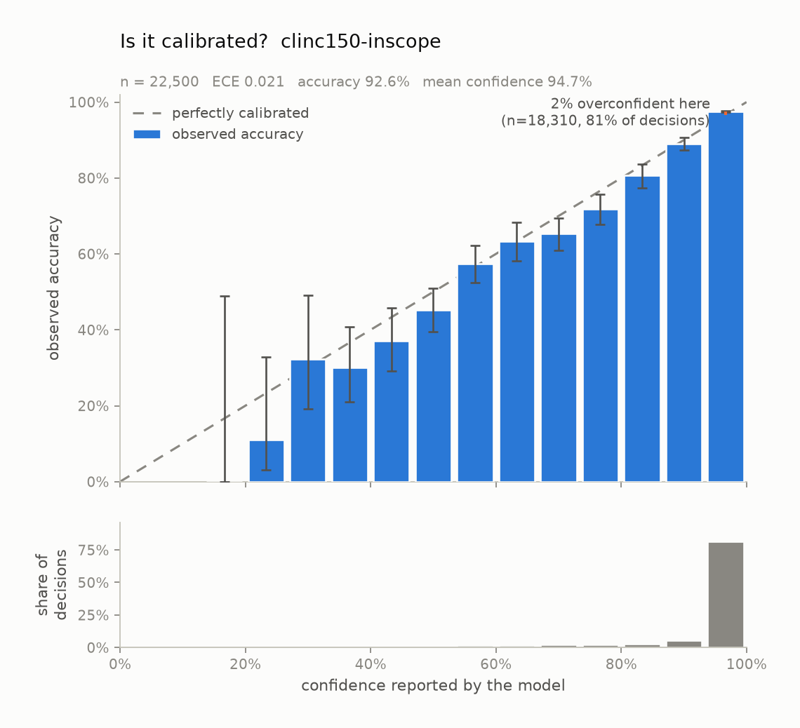

# is-jev-calibrated

**An independent calibration audit for typed-decision models.** Built for
TypeSafe's [Jev](https://typesafe.ai), and useful for anything that returns a
probability alongside a decision.

Jev's speed and price are easy to check, and several people already have. Its
distinguishing claim is harder: that every decision arrives with a *calibrated*
probability. That claim is the reason you would put it in front of a frontier
model at all — a confidence you can gate on is worth more than a confidence you
can only read. As far as I can tell nobody has published a reliability diagram
for it, and the vendor hasn't either.

This repo is the harness to settle it, on your data, with numbers you ran
yourself.

```
python -m jevcal audit my-task.json --provider gateway
```

Out comes a reliability diagram, an Expected Calibration Error with a bootstrap
interval, and the number an engineer actually needs: **the confidence threshold
above which it is safe to stop looking.**

---

## Status: measured

**Jev is well calibrated on this task — and how you describe your options
matters more than the model does.** 51,000 decisions against `jev-1.13.0` on
CLINC150, 0 failed, $5.16. Full writeup, written for engineers with no stats
background, in [`results/README.md`](results/README.md).

On 150-way intent classification: **92.63%** accuracy where guessing gets 0.67%,
**ECE 0.021**, AUROC 0.851. As far as I can tell, the first reliability diagram
published for this model.



Three findings worth your time.

**Most of the miscalibration we measured was our own prompt.** We sent 150 class
names with no descriptions — `"reminder_update": "reminder update"` — which says
nothing about what separates it from `reminder`. Adding one sentence of
description to 16 of the 150 classes cut errors on those rows by **63%** and
miscalibration **eightfold** (ECE 0.1701 → 0.0207). TypeSafe's docs tell you to
write real descriptions. They are right, and the cost of ignoring them is large.

**It reports certainty it does not have.** A probability of *exactly 1.000* on
**62% of all decisions**, wrong 219 of those times. If your code branches on
`confidence == 1.0` you are getting a 1.6% error rate, not a guarantee.

**The boolean scope gate fails outright.** Asked "is this in scope?" as a
yes/no, confidence turns over at the top — the 0.93–1.00 band delivers *less*
accuracy than the band below it — and **no threshold meets an error budget of
even 10%**. Asked as a Choice with a rejection option, the same question works:
72.7% of out-of-scope queries caught at a 0.89% false-alarm rate.

Calibration is per-distribution and this is one dataset, so it licenses one
claim: short-utterance intent classification with informative class names. It is
not "Jev is calibrated". Numbers come from the direct API rather than the
gateway; see the terms note at the end of the writeup.

[`HANDOVER.md`](HANDOVER.md) was the brief for the run. Its highest-risk
assumption turned out to be wrong in a way worth reading:
[`docs/api-notes.md`](docs/api-notes.md) is the verification trail, and
[`results/confident-errors.md`](results/confident-errors.md) examines what the
model gets wrong when it claims certainty — and whether the dataset is to blame.

## What it measures

| Question | What answers it |
| --- | --- |
| When it says 90%, is it right 90% of the time? | reliability diagram, ECE, MCE |
| Does it lean one way? | mean confidence minus accuracy; logistic refit slope and intercept |
| Is the *shape* wrong, or just shifted? | slope < 1 means the probabilities are too extreme |
| Can confidence rank its own mistakes? | AUROC of confidence vs. correctness |
| Where do I set the gate? | risk-coverage curve, AURC, per-budget threshold recommendations |
| Is any of this above noise? | Wilson intervals per bin, bootstrap interval on ECE |

Calibration and discrimination are kept apart on purpose. A model can be badly
calibrated and still rank its errors below its hits, which is all a confidence
*gate* needs; and a model can be beautifully calibrated while carrying no
information at all. Conflating the two is the most common way a calibration
claim gets mis-sold in either direction.

## Quickstart (no API key, no network)

Python 3.10 or newer. On a Mac, note that `/usr/bin/python3` is 3.9 — build the
virtualenv against a newer interpreter (`python3.12 -m venv .venv`) rather than
the system one.

```bash
pip install -r requirements.txt
python -m jevcal audit examples/tasks/demo-choice.json --provider simulated
open report/report.md
```

That runs 2,000 synthetic decisions through a model whose miscalibration was
*chosen*, and writes `report/` with a Markdown report, a `results.json`, and six
charts (three, in light and dark). The output is committed at
[`examples/sample-report/`](examples/sample-report/) if you want to see the shape
of the result first.

The simulator is not a stand-in for results. It is there so the pipeline is
exercisable in CI, and so the audit can be checked against a known answer:
`tests/test_calibration_recovery.py` asserts that a perfectly calibrated
simulator is *not* accused of miscalibration, that a temperature-0.5 distortion
is read back as a fitted slope near 0.5, and that a recommended gate still holds
on data its threshold was not chosen on. An audit whose own machinery is
unvalidated is not evidence of anything.

## Running it for real

### 1. Bring a labelled dataset

Any CSV or JSONL with a text column and a ground-truth label column:

```bash
python -m jevcal make-task reviews.csv \
  --out tasks/sentiment.json \
  --question "What is the sentiment of this review?" \
  --label-map '{"0": "negative", "1": "positive"}'
```

For an ordered rubric, pass the rungs in order — the order *is* the rubric:

```bash
python -m jevcal make-task tickets.jsonl \
  --out tasks/urgency.json --kind score \
  --labels low medium high critical \
  --question "How urgent is this support ticket?"
```

The audit is only as credible as the dataset behind it, so this repo ships
converters rather than a favourite benchmark. Pick something public, say which
split you used, and publish the task spec alongside the numbers.

### 2. Confirm the response shape

```bash
export AI_GATEWAY_API_KEY=...
python -m jevcal probe tasks/sentiment.json
```

`probe` sends one request and prints the payload, the raw response, the endpoint
it went to, and which extraction paths work against it. **Do this before a long
run**, so a mapping change shows up on request one rather than on request 10,000.

Jev is an *evaluation* model, not a chat model: it does not generate text, and it
is not reachable through OpenAI-compatible endpoints. The client posts a shared
`state` plus a map of typed `questions`, and reads the distribution straight off
the answer — `probabilities` for a Choice or Score, a single `probability` for a
yes/no. If that field is missing the run fails loudly instead of inventing a
confidence. [`docs/api-notes.md`](docs/api-notes.md) has the full shape of all
three answer types, captured live.

Two surfaces serve the same model, selected with `--surface`:

| | `gateway` (default) | `typesafe` |
| --- | --- | --- |
| endpoint | `ai-gateway.vercel.sh/v1/evaluate` | `api.typesafe.ai/v1/systemone` |
| availability | generally available | waitlisted, early-access agreement |

Prefer the gateway: its terms are the ones that let you publish without checking
an agreement first.

One thing this client will never do is ask the model to *write* a confidence
number into its output. A self-reported number in generated text is a different
object from a calibrated distribution, and auditing it would answer a different
question than the one on the label.

#### What gets calibrated, and what doesn't

Jev returns a `confidence` alongside the distribution, and TypeSafe's docs tell
you to gate on it. It is **not** the probability of the chosen option — it is one
minus the normalised entropy of the distribution, a measure of how *peaked* the
answer is rather than how likely it is to be right. It has no reason to sit on
the reliability diagonal even for a perfectly calibrated model.

So the reliability diagram here plots `max(probabilities)`, which is the quantity
that should equal the accuracy. Jev's own `confidence` is recorded next to it as
`reported_confidence` so the two can be compared, and never plotted as if it were
the same object.

### 3. Run the audit

```bash
python -m jevcal audit tasks/sentiment.json --provider gateway --concurrency 8
```

Leave concurrency at 8. TypeSafe's own cookbooks note the public endpoint
rate-limits above roughly eight workers, and a run that trips the limit is slower
than one that doesn't.

Results stream to `runs/*.jsonl` one row at a time and a rerun skips what is
already on disk, so a run interrupted at example 7,431 costs you nothing to
resume. Failed requests are recorded as failures and excluded from the analysis
rather than quietly dropped; the report says how many there were.

Why the gateway and not the direct API: `typesafe-ai/jev` is generally available
through the [Vercel AI Gateway](https://vercel.com/docs/ai-gateway), while the
direct TypeSafe API is waitlisted behind an early-access agreement. Auditing the
generally-available endpoint keeps published numbers clear of any early-access
restriction, and is the endpoint most readers can reproduce against. Point
`JEV_BASE_URL` elsewhere if you have direct access and its terms allow it.

## The charts

**Reliability diagram** — predicted confidence against observed accuracy, with
95% Wilson intervals and the bin counts underneath. A calibrated model's bars sit
on the diagonal; bars below it are overconfidence. The count panel is there
because a dramatic gap in a bin holding nine predictions is noise, and that is
exactly the bin a screenshot will crop to.

**Risk-coverage curve** — error rate against the share of traffic you handle
automatically. The marked point is the recommended gate.

**Confidence histogram** — what it claims and how often, with the gap between
mean confidence and accuracy shaded.

Every plotted value also appears as a table row in `report.md`. Nothing here is
readable only as a picture.

## How the gate recommendation stays honest

Two rules, both of which cost coverage and are worth it:

1. A threshold is recommended only when the **upper** 95% bound on its error
   clears the budget, not the point estimate. Picking the threshold that happened
   to look best on your sample is how a gate that "tested at 1% error" ships at
   4%. When only the point estimate clears, the recommendation is returned
   flagged `provisional`, not returned silently.
2. No recommendation is made on a slice thinner than 30 predictions. An error
   rate measured on a dozen rows is not a measurement.

`tests/test_calibration_recovery.py` holds this to account the only way that
counts: choose the threshold on half the run, measure it on the other half.

## What a published result should say

If you write this up, the things that make it an audit rather than a vibe:

- the dataset, split, and number of examples, with the task spec committed;
- the model version (`jev-latest` resolves to a specific build — record it);
- the majority-class baseline next to the accuracy, so the accuracy means
  something;
- ECE **with** its interval, and the binning scheme, since ECE is a biased and
  noisy estimator and the bin count moves it;
- a negative result if you get one. An honest "it isn't calibrated on this data"
  is a more useful contribution than another 90%-accuracy screenshot, and it is
  the result the field is currently missing.

## What this does not show

- **Calibration is per-distribution.** A model calibrated on product reviews can
  be badly calibrated on medical text. One dataset licenses one claim.
- **Context length is a separate experiment.** Everything here fits comfortably
  in context; long or noisy states are known to degrade these models and are not
  tested by this harness.
- **Type-safe is not correct.** Every error counted here was a perfectly valid,
  in-schema value that happened to be wrong. "It cannot emit an out-of-schema
  value" and "it cannot be wrong" are different claims, and only the first one is
  structural.
- **Gating moves the problem, it doesn't remove it.** The escalated tail still
  has to go somewhere, and that somewhere has its own cost and its own error
  rate.
- **Vendor figures are not reproduced here.** Any speed, cost or accuracy numbers
  TypeSafe publishes are theirs; this repo measures what your own run measures
  and nothing else. Latency reported by the runner is end-to-end including
  network, which is not the same thing as model time.

## Layout

```
jevcal/
  types.py       Task / Example / Prediction, and the task-spec format
  datasets.py    CSV and JSONL converters, plus a synthetic task for demos
  providers/
    gateway.py   Jev via the evaluation API, both surfaces, and the extraction
    simulated.py the offline miscalibration simulator
  runner.py      concurrent, resumable batch execution
  metrics.py     ECE, MCE, Brier + decomposition, NLL, AUROC, Wilson, bootstrap
  selective.py   risk-coverage curves and gate recommendations
  analysis.py    everything above, assembled into one AuditResult
  plots.py       the three charts, light and dark
  report.py      report.md and results.json
  cli.py         run / analyze / audit / probe / make-task
docs/
  api-notes.md   what the API actually returns, and what that costs the audit
scripts/
  build_clinc150.py  the dataset loader behind the committed task specs
```

## Licence

MIT. See [LICENSE](LICENSE).
