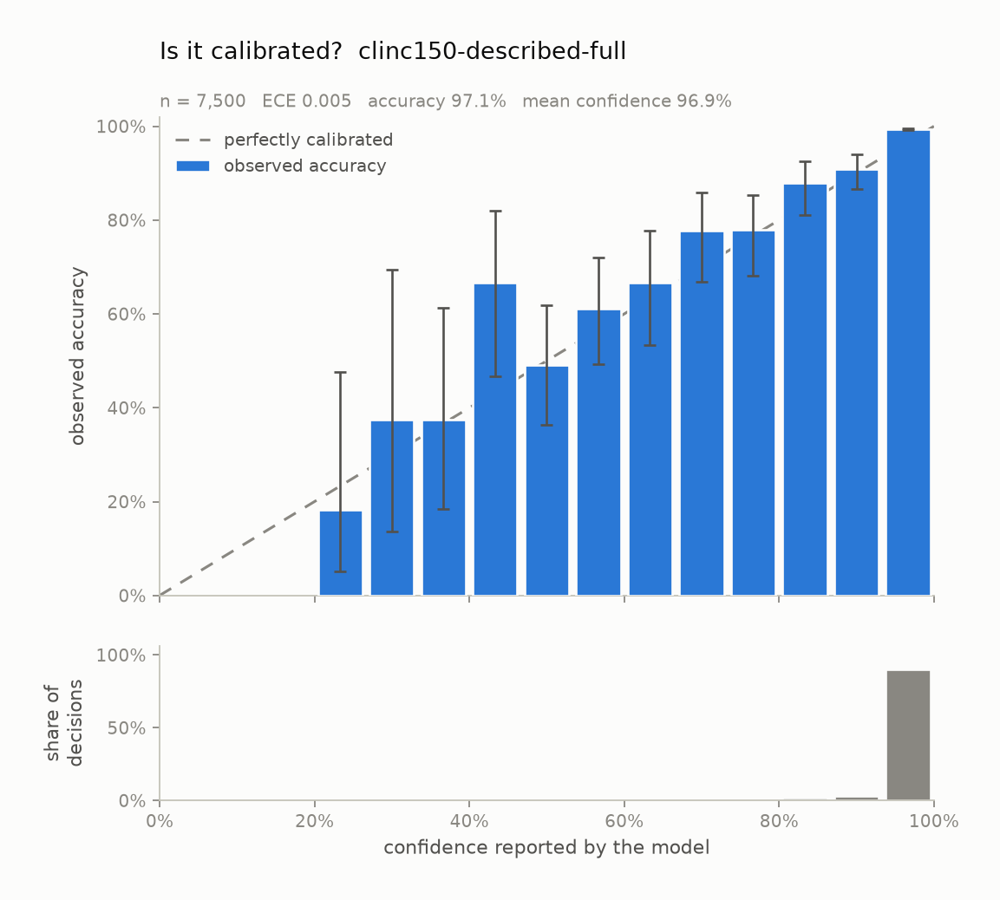

# Is Jev calibrated? An independent audit

*Written for engineers deciding whether to gate production traffic on this
model's confidence. No statistics background assumed — every metric is explained
where it first appears. For what this project is and how to rerun everything,
see the [README](README.md).*

| | |
| --- | --- |
| **Model** | `jev-1.13.0` (what `jev-latest` resolved to on every one of 51,000 calls) |
| **Endpoint** | `api.typesafe.ai/v1/systemone`, 2026-09-19 |
| **Dataset** | [CLINC150](https://github.com/clinc/oos-eval) — Larson et al., EMNLP 2019, CC BY-SA 3.0 |
| **Decisions** | 60,900 across six experiments, 0 failed requests |
| **Cost / speed** | ~$8 total including probes (~$0.13 per 1,000 decisions), 160 ms median end-to-end |
| **Data** | every decision in [`results/decisions.csv`](results/decisions.csv); charts regenerate from committed task specs |

## Findings at a glance

Jev's pitch is that every decision arrives with a probability you can trust —
the reason you'd put a small fast model in front of a frontier model at all. As
far as we can tell, nobody had published a reliability diagram for it. The
audit's findings converge on one thesis:

> **Jev is about as calibrated as the question you send it. Under-specified
> questions come back overconfident; well-specified ones come back honest.**

| # | finding | where |
| --- | --- | --- |
| 1 | Asked with bare class names, it is **well calibrated in aggregate** — 92.6% accuracy on a 150-way task (baseline 0.67%), ECE 0.021 — but **overconfident**, reporting probability `1.000` on 62% of decisions and getting 219 of those wrong | [E1](#experiment-1--150-way-classification) |
| 2 | **Describing every class by a mechanical, error-blind rule** lifts the same task to 97.1% accuracy, **ECE 0.0046, bias −0.2%** — no systematic lean, on held-out rows. Specification quality is the biggest lever anywhere in this audit | [E1c](#experiment-1b--how-much-do-class-descriptions-matter) |
| 3 | The boolean scope gate is **unusable when the scope is one prose sentence** (no threshold meets even a 10% error budget) and **matches the 151-way Choice when the scope is enumerated** — AUROC 0.970 vs 0.972 as an out-of-scope detector, on identical rows. The primitive was never the problem | [E3](#experiment-3--the-same-question-as-a-yesno), [head-to-head](#head-to-head-one-question-three-specifications) |
| 4 | What specification cannot fix: probabilities are **quantised to 0.01** and `1.000` still overclaims (wrong 14 times even in the clean run); calibration **degrades ~4× on out-of-distribution input**; and contested decisions are **stochastic** — repeat the same request and the argmax can flip | [E2](#experiment-2--out-of-scope-detection-with-an-escape-hatch), [checks](#checks-a-sceptical-reader-would-ask-for) |

If you take one thing away: **describe every option and enumerate the scope —
the model can only be as honest as the question — and even then, treat `1.000`
as "very likely", never as a guarantee.**

---

## Background: what "calibrated" means

*Skip if familiar.*

Any classifier gives you an answer. A **calibrated** one also tells you how
likely that answer is to be right — and means it:

> Take every decision where the model said **70%**. If it's calibrated, about 70
> in 100 of those are correct. Not 90, not 50.

Calibration is a different property from accuracy, and they come apart in both
directions. A model can be accurate but uninformative about its confidence
(right 95% of the time, always claiming 100%), or perfectly calibrated and
useless (always answering "0.67% confident" on a 150-way task). Calibration is
what makes **automation** possible: if "95%" genuinely means 5% wrong, you can
auto-handle those and route the rest to a human, and know your error rate
before you ship.

**The reliability diagram** is the standard picture: bucket decisions by claimed
confidence, plot claimed against delivered. The diagonal is perfection; bars
below it are overconfidence. The count panel underneath matters as much as the
bars — a dramatic gap over four predictions is noise, and that's exactly the bar
a screenshot crops to.

**Three numbers used throughout:**

- **ECE** (expected calibration error): the average gap between claimed and
  delivered, weighted by how many decisions sit at each confidence level. 0 is
  perfect; 0.02 means claims are typically ~2 points off. Its weakness: it's an
  average, so one huge well-behaved region can drown a small disastrous one.
- **MCE** (maximum calibration error): the single worst confidence band instead
  of the average — what a gate placed in the wrong region trips over.
- **AUROC**: a separate question — can confidence *rank* its own errors? Sort
  all decisions by confidence; do the wrong ones sink to the bottom? 0.5 = no
  signal, 1.0 = perfect separation. This, not ECE, is what a gate mechanically
  relies on.

---

## Method

### How Jev is asked

Jev doesn't generate text, so there is no prompt in the chat sense — no system
prompt, no examples, no output parsing. Each request is a structured object: a
`state` (here, one utterance) and typed `questions`:

```json
{
  "model": "jev-latest",
  "state": "what expression would i use to say i love you if i were an italian",
  "questions": {
    "decision": {
      "type": "choice",
      "instructions": "Which intent does this user utterance express?",
      "criteria": {
        "accept_reservations": "accept reservations",
        "account_blocked": "account blocked",
        "...148 more...": "..."
      }
    }
  }
}
```

Three properties that shape everything below:

- **`criteria` *is* the classifier.** All 150 class names travel on every
  request; the answer is a probability distribution over exactly those keys.
  Nothing persists between calls.
- **It is zero-shot.** The model never sees a labelled example. Everything it
  knows about a class comes from the name and description you send.
- **The output is structurally constrained.** Across 22,500 decisions, zero
  predictions and zero probability keys fell outside the option set.

The probability we audit is `max(probabilities)` — the probability the model
assigns to its own answer. Jev also returns a separate `confidence` field which
is **not** that number (see [checks](#checks-a-sceptical-reader-would-ask-for)).

### The dataset

CLINC150: 22,500 short user utterances ("*how do i say 'hotel' in finnish*")
over 150 intents, exactly 150 rows per intent — so always guessing the
commonest class scores **0.67%**, which is what makes the accuracy numbers
meaningful. It also ships 1,200 **out-of-scope** utterances: reasonable requests
("*is there a vaccine for ebola*") that none of the 150 intents cover, labelled
`oos`. In production, out-of-scope traffic is most of what a narrow assistant
hears; predicting it is half the reason this dataset exists.

### How the harness stays honest

- Failed requests are recorded and excluded, never silently dropped; every run
  reports its failure count (all four runs: 0).
- A confidence gate is recommended only when the *upper* 95% bound on its error
  clears the budget, on 30+ decisions — and gates are additionally validated by
  choosing the threshold on half the data and measuring on the other half.
- The pipeline is itself tested against a simulator with known miscalibration:
  the audit provably recovers a planted distortion and does not accuse a
  calibrated model ([`tests/test_calibration_recovery.py`](tests/test_calibration_recovery.py)).

---

## Experiment 1 — 150-way classification

**Setup.** All 22,500 in-scope utterances; one 150-way Choice per row; classes
described only by their own names (underscores → spaces). One decision ≈ 2,500
input tokens, because the full class list rides along every request.

**Results.**


| metric | value | plain English |
| --- | --- | --- |
| accuracy | **92.63%** | vs 0.67% for always guessing one class |
| mean confidence | 94.71% | what it claimed, on average |
| overconfidence | **+2.08%** | claimed − delivered |
| ECE | **0.0209** (95% CI 0.0188–0.0245) | typical claim-vs-reality gap |
| ECE, equal-count buckets | 0.0208 | agrees ⇒ not a bucketing artifact |
| MCE (buckets n ≥ 30) | 0.0714 | worst single band |
| AUROC | **0.851** | confidence ranks its errors well |
| calibration slope | 0.283 | probabilities too extreme in shape (1.0 = right) |
| latency p50 / p95 | 160 / 284 ms | end-to-end, including network |

**Reading.** A strong result — but the ECE deserves suspicion before credit.
81% of decisions land in the top confidence bucket, and that bucket contributes
three-quarters of the ECE; the worst-calibrated bucket (off by 18 points) holds
four decisions and contributes nothing:

| bucket | n | share | claims | delivers | gap |
| --- | --- | --- | --- | --- | --- |
| 0.13–0.20 | 4 | 0.0% | 0.181 | 0.000 | +0.181 |
| 0.47–0.53 | 281 | 1.2% | 0.504 | 0.452 | +0.052 |
| 0.87–0.93 | 1,283 | 5.7% | 0.904 | 0.891 | +0.013 |
| **0.93–1.00** | **18,310** | **81.4%** | 0.994 | 0.975 | +0.019 |

So "ECE 0.021" mostly means *the big bucket is fine* — which is fortunate,
because the big bucket is where automated decisions get made.

### The 1.000 problem

Probabilities arrive rounded to two decimals, so at or above 0.98 only three
values exist: 0.98, 0.99, 1.00. What it actually reports:


| reported | n | share of run | actually correct |
| --- | --- | --- | --- |
| **1.00** | **13,977** | **62.1%** | 98.43% |
| 0.99 | 1,710 | 7.6% | 96.08% |
| 0.98 | 885 | 3.9% | 94.92% |
| 0.97 | 577 | 2.6% | 94.80% |
| 0.96 | 443 | 2.0% | 93.23% |
| 0.95 | 356 | 1.6% | 91.29% |

The ordering is right — higher claims are more accurate. But the single most
common thing this model says is *certain*, and it is wrong 219 times when it
says it. A 0.99 that fails 1% of the time is doing its job; a 1.00 that fails
at all is asserting that no other outcome was possible. **`if confidence == 1.0`
is not a guarantee; it is a 1.6% error rate.**

### Where it is safe to automate


| error budget | gate | traffic handled | measured error |
| --- | --- | --- | --- |
| 1% | — | — | **unreachable** — the most selective slice still errs at 1.6% |
| 5% | ≥ 0.69 | 93.6% | 4.66% |
| 10% | ≥ 0.14 | 100% | 7.37% |

Held out — threshold chosen on half the run, measured on the unseen half — the
2% gate fit at 1.58% error and delivered **1.55%**; the 5% gate fit at 4.53% and
delivered **4.40%**. The gates transfer, which is the property that matters.
Note what the 2% gate *is*, though: "act only when the model claims 1.00",
covering 62% of traffic.

---

## Experiment 1b — how much do class descriptions matter?

**The largest effect in this report, established in two stages: an exploratory
pass that found it, and a clean pass that pins it down.**

E1 described each class by its own name — a realistic wiring, since class names
are what you have. But names are all the model gets, and CLINC150's taxonomy
hangs real distinctions on small differences: `reminder` means *read my
reminders back*, `reminder_update` means *create one*. TypeSafe's docs warn
about exactly this ("*write descriptions that separate the options from each
other*"), so the cost of ignoring them is worth measuring.

### Stage one, targeted (exploratory)

2,400 rows re-run — every row whose gold class was one of the 16 involved in
E1's dominant confusions — with one hand-written sentence per class. Same
model, same 150 options, same question, same rows:

| on those 2,400 rows | bare names | described |
| --- | --- | --- |
| accuracy | 75.25% | **90.96%** |
| overconfidence | +14.93% | **+1.46%** |
| ECE | 0.1701 | **0.0207** |
| errors at `1.000` | 167 | **7** |

`reminder_update → reminder` fell from 149 errors to 9; `last_maintenance →
oil_change_when` from 39 to 0. But those 16 classes were chosen *by looking at
which ones failed*, and the sentences were written knowing the answer — so this
stage is an upper bound on nothing-in-particular. It motivates the clean pass;
it should not be quoted.

### Stage two, clean (the quotable version)

All **150** classes described by one mechanical rule, fixed in advance and
applied uniformly with no per-class judgement: each class's first three
*training* utterances, in file order, verbatim —

```json
"translate": "e.g. \"what expression would i use to say i love you if i were an
             italian\" / \"can you tell me how to say 'i do not speak much
             spanish', in spanish\" / \"what is the equivalent of, 'life is
             good' in french\""
```

— and scored on **val+test only** (7,500 rows), so the exemplar source and the
evaluated rows are disjoint. Baseline: the bare-name E1 run on exactly the same
rows. (Reproduce: [`scripts/description_effect.py`](scripts/description_effect.py).)



| on 7,500 held-out rows | bare names | all classes described |
| --- | --- | --- |
| accuracy | 92.69% | **97.11%** |
| errors | 548 | **217** |
| overconfidence | +1.81% | **−0.18%** |
| ECE | 0.0211 | **0.0046** (95% CI 0.004–0.009) |
| AUROC | 0.855 | **0.924** |
| errors at `1.000` | 72 | 14 |

**Reading.**

- With classes actually specified, Jev on this task is **about as calibrated as
  the instrument can measure** — a 0.5% average gap with no systematic lean, at
  97% accuracy. The E1 headline measured the request, not the model's ceiling.
- The bias *changes sign*: bare names produce overconfidence (+1.8%); described
  classes produce a model that is fractionally under-confident (−0.2%). It
  claims `1.000` *more often* with descriptions (71.7% of rows vs 61.6%) and
  earns it far more often (14 wrong vs 72).
- **Class names are not specifications.** Three verbatim example utterances per
  class — no craft, no tuning — is enough. If your class taxonomy contains
  compound names (`X` and `X_update`), treat bare-name criteria as a bug.

## Experiment 2 — out-of-scope detection, with an escape hatch

**Setup.** Same 150-way question, plus a 151st option: `oos`, described as
"*none of the other categories fit: the request is outside the set of things
this assistant handles*" (the one description E2 carries — the bare token would
mean nothing). Rows: all 22,500 in-scope plus all 1,200 out-of-scope.

**Results.**


| slice | n | accuracy | mean confidence | gap |
| --- | --- | --- | --- | --- |
| in-scope | 22,500 | 92.32% | 94.06% | +1.74% |
| **out-of-scope** | 1,200 | 72.67% | 79.70% | **+7.04%** |

As a rejector: **72.7%** of out-of-scope utterances routed to `oos`, wrongly
rejecting only **0.89%** of legitimate traffic. Adding the option cost
essentially nothing on in-scope rows (92.32% vs 92.63% in E1).

**Reading.** Workable — but calibration is **four times worse on out-of-scope
input**, which is precisely where a confidence number earns its keep. When it
misses an out-of-scope query it is, on average, 70% confident in some concrete
wrong intent (`fun_fact`, `definition` and `date` are the commonest wrong
destinations).

---

## Experiment 3 — the same question as a yes/no

**Setup.** Jev's boolean primitive ("noul"), asked directly: *"Is this user
utterance something the assistant can handle?"* A boolean takes no option list,
so the scope has to live in the instructions — and this experiment ran twice,
differing only there:

- **E3, one-sentence scope:** "…a fixed set of 150 everyday personal-assistant
  intents: banking, travel, vehicles, small talk, utilities, work and home
  automation."
- **E3b, enumerated scope:** the same instruction, but listing all 150 intent
  names ("accept reservations, account blocked, alarm, …").

2,400 rows, balanced 50/50 (all 1,200 out-of-scope + 1,200 seeded in-scope), so
the baseline is 50%.

**Results.**


| identical 2,400 rows | one-sentence scope | scope enumerated |
| --- | --- | --- |
| accuracy | 71.92% | **90.50%** |
| ECE | 0.0468 | 0.0259 |
| overconfidence | +4.68% | **−2.5%** (now *under*-confident) |
| AUROC (confidence vs correctness) | 0.663 | 0.831 |
| error budgets with a workable gate | none of 1/2/5/10% | **all of 1/2/5/10%** |

With the one-sentence scope, confidence stops being informative exactly where a
gate would sit: the 0.93–1.00 band claims 94.8% and delivers 80.6%, *worse than
the band below it*, and no threshold meets any tested budget. With the scope
enumerated, the same primitive on the same rows becomes a working instrument.

**Reading.** The boolean primitive was never broken — it was under-informed.
"150 everyday personal-assistant intents" reads like a specification to a human
who can imagine the list; the model demonstrably could not. Note the now-familiar
sign flip: the under-specified question is overconfident, the well-specified one
slightly timid (the logistic refit slope goes from 0.70 to 1.23 — past honest,
into hedging).

## Head-to-head: one question, three specifications

All three framings scored the **same 2,400 utterances**, and each yields one
probability per row for "this is out of scope": E2's `P(oos)` from the 151-way
Choice, and `P(false)` from each noul variant. Same model, same rows, same
decision. (Reproduce: [`scripts/rejector_comparison.py`](scripts/rejector_comparison.py).)

| out-of-scope detector | AUROC | caught @1% FA | @5% | @10% |
| --- | --- | --- | --- | --- |
| noul, one-sentence scope | 0.786 | 14.0% | 36.9% | 45.4% |
| **noul, scope enumerated** | **0.970** | **67.5%** | **85.4%** | **93.3%** |
| **Choice with `oos` option** | **0.972** | **70.4%** | **91.9%** | **95.0%** |

Read bottom-up: the five-fold gap between the first and last rows looks like a
story about primitives — until the middle row closes almost all of it by
changing *only the words in the instructions*. What the Choice framing was
really providing was the list of what "in scope" means. Give the boolean the
same list and the two are within noise of each other.

The residual edge for the Choice (70.4% vs 67.5% at 1% FA) is real but small,
and the Choice also tells you *which* intent to route to. Practical upshot:
**use whichever primitive fits your control flow, and spend your effort on the
specification** — it moved these numbers by 4–5×; the primitive moved them by a
few points.

## Checks a sceptical reader would ask for

**Is it just memorising a public dataset?** If the model had memorised
CLINC150's training split, it should do better there. It doesn't: train 92.59%,
validation 93.37%, test 92.24% — a 0.35-point spread inside the confidence
intervals. This rules out the training split being special; it cannot rule out
the whole (equally public) file being in pretraining. Calibration, the object
of study here, is less contamination-sensitive than accuracy: it concerns the
*relationship* between confidence and correctness, not the level of
correctness.

**Is the benchmark itself at fault?** The confident errors cluster on six pairs
of near-synonymous classes, which reads like annotation noise — but sampling
what CLINC150 labels with the *other* class in each pair shows a deliberate,
consistent taxonomy, and on 372 of the 395 decisions in question the dataset is
right and the model is wrong. Genuine label noise: two pairs, 23 decisions,
0.0007 of ECE. Full working, and a note on how tempting the wrong conclusion is,
in [`results/confident-errors.md`](results/confident-errors.md).

**Is `confidence` the probability of the answer?** No — trap. Jev's separate
`confidence` field is one minus the normalised entropy of the distribution: a
measure of how *peaked* the answer is, not how likely it is to be right. On
150-option tasks the two happen to track closely; on the 3-option example in
TypeSafe's own docs, probabilities `{0.84, 0.16, 0.00}` carry `confidence`
0.596. This audit gates on `max(probabilities)` throughout, and records the
`confidence` field beside it in the per-decision data.

**Does it ever break the schema?** No. Zero out-of-schema values in 22,500
decisions. (Distinct from correctness: all 1,659 errors were valid in-schema
values that were wrong.)

**Does the 0.01 rounding matter?** At the top, yes: with three reportable
values at or above 0.98 — where 74% of decisions sit — the shape of the top of
the curve is an instrument limit, not a measurement. It also floors the true
class at 0.00 on most errors, which makes log-loss (NLL) a function of the clip
constant rather than the model; NLL is therefore not quoted anywhere in this
report.

**Is the model deterministic?** Only when it's sure. Twenty utterances sent
three times each ([`scripts/determinism_probe.py`](scripts/determinism_probe.py)):
all ten high-confidence rows returned bit-identical distributions; all ten
contested rows wobbled by a few hundredths, and on at least three the *argmax
flipped* between repeats ("alert me in 20 minutes" went `reminder` 0.42 /
`timer` 0.41 across runs). Single-shot numbers in this report therefore measure
average behaviour — the operationally relevant quantity for a gate — and
near-threshold routing decisions carry sampling noise of their own: a
borderline row may be routed differently on retry.

---

## Recommendations for anyone building on Jev

1. **Specify every option, always.** The single biggest lever in this audit, by
   far. Three verbatim example utterances per class — generated mechanically,
   no craft — took the same task from ECE 0.021 and overconfident to ECE 0.0046
   and unbiased. Bare class names are a measurable bug, especially compound
   names that contain each other (`X` / `X_update`).
2. **Enumerate the scope for yes/no questions.** A boolean whose instructions
   say "requests of that general kind" gave us an ungateable instrument; the
   same boolean with the 150 in-scope types listed matched the Choice detector
   at every operating point. If the list fits in the request, send the list.
3. **Pick the primitive by control flow, not by accuracy.** Once both were
   properly specified, Choice-with-rejection and boolean were within a few
   points of each other. The Choice additionally tells you where to route.
4. **Never treat `1.000` as a guarantee.** It is the model's most common claim,
   and it retains a measurable error rate even in the best-specified run (14
   wrong of 5,375 certainty claims — 0.26%).
5. **Gate on `max(probabilities)`, not the `confidence` field**, unless you
   have verified what the entropy-based `confidence` does on *your* option
   count.
6. **Choose thresholds on held-out data, against the upper error bound.** Ours
   transferred (1.58% → 1.55%); a threshold tuned on the sample it is quoted on
   will flatter you.
7. **Expect degraded calibration on out-of-distribution input** (4× here), and
   budget the escalation path for it.
8. **Retry borderline decisions knowingly.** Contested rows are stochastic; a
   retry can flip the answer. Either pin decisions by idempotency key on your
   side, or treat near-threshold flips as part of your error budget.

---

*Every plotted value in this report also exists as a table row or a CSV column,
so nothing is readable only as a picture. Numbers come from TypeSafe's direct
API (the generally-available Vercel gateway serves the same model; the key used
here authenticated only against the direct API). TypeSafe's public terms contain
no restriction on publishing evaluation results; if you run under an
early-access agreement, check it before publishing your own.*
