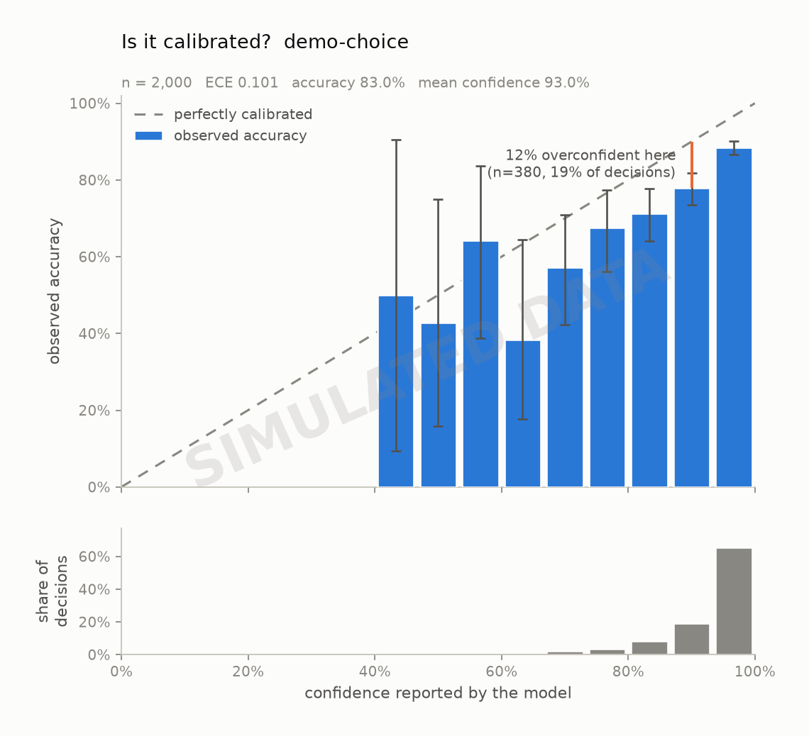
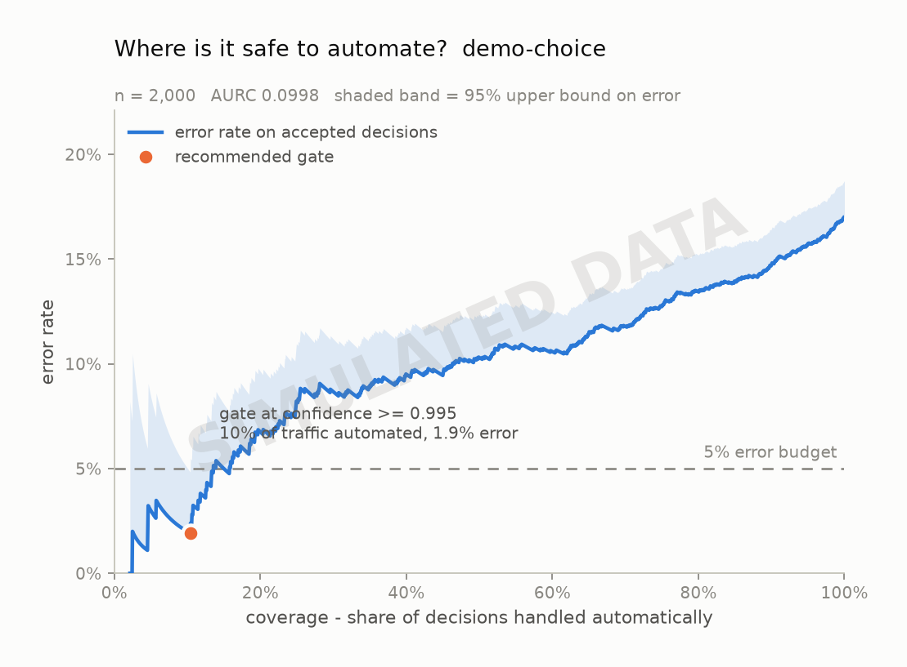
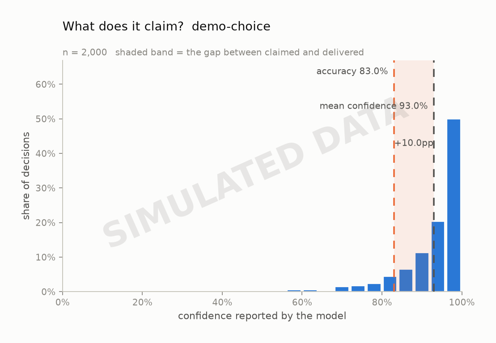

# Calibration audit: `demo-choice`

> **These numbers are synthetic.** They come from the built-in simulator, not from a model. They exist to exercise the pipeline and to check that the audit recovers a miscalibration it was given on purpose. Do not cite them.

*Model:* `simulated` &nbsp;&nbsp; *Task type:* `choice` &nbsp;&nbsp; *Examples:* 2,000 &nbsp;&nbsp; *Generated:* 2026-09-19 05:20 UTC

## Verdict

On 2,000 labelled examples from `demo-choice`, this model is **badly miscalibrated** (ECE 0.101, 95% CI 0.086-0.118) and overconfident by 10.0% on average. Its probabilities are too extreme: a logistic refit pulls them toward the middle (fitted slope 0.51, where 1.00 is perfect). Separately from calibration, the confidence ranks its own errors at AUROC 0.677, which is what a confidence *gate* actually relies on.

## Headline numbers

| metric | value | what it means |
| --- | --- | --- |
| accuracy | 83.00% | share of decisions that matched the label |
| majority-class baseline | 34.00% | accuracy of always answering the commonest label |
| mean confidence | 92.97% | what the model claimed, on average |
| overconfidence | +9.97% | mean confidence minus accuracy; positive = charges more than it delivers |
| ECE (15 equal-width bins) | 0.1008 | average distance between claimed and delivered |
| ECE 95% CI | 0.0861 - 0.1177 | 1,000-resample bootstrap |
| ECE (15 equal-mass bins) | 0.0997 | same idea, bins holding equal counts |
| MCE (bins with n >= 30) | 0.1335 | worst single band -- what a gate trips over |
| Brier score | 0.1429 | proper score over the top label; lower is better |
| - reliability | 0.0114 | the miscalibration part; 0 is perfect |
| - resolution | 0.0092 | how far it separates cases; higher is better |
| - uncertainty | 0.1411 | irreducible difficulty of the task |
| AUROC of confidence vs. correctness | 0.6767 | can confidence rank its own errors? 0.5 = no signal |
| NLL of the true label | 0.6790 | punishes confident mistakes hardest |
| multiclass Brier | 0.3015 | over the whole distribution, not just the winner |
| logistic refit slope | 0.5085 | 1.00 = right shape; < 1 = too extreme |
| logistic refit intercept | +0.0766 | 0.00 = no constant bias |
| latency p50 / p95 | 92 ms / 115 ms | end to end, including network |
| total cost | $0.0000 | $0.0000 per 1,000 decisions |

## Is the number honest?

Every bar above is also a row here, with its 95% Wilson interval:

| confidence bin | n | mean confidence | observed accuracy | 95% CI | gap |
| --- | --- | --- | --- | --- | --- |
| 0.40-0.47 | 2 | 0.459 | 0.500 | 0.095 - 0.905 | -0.042 |
| 0.47-0.53 | 7 | 0.511 | 0.429 | 0.158 - 0.750 | +0.083 |
| 0.53-0.60 | 14 | 0.576 | 0.643 | 0.388 - 0.837 | -0.067 |
| 0.60-0.67 | 13 | 0.628 | 0.385 | 0.177 - 0.645 | +0.243 |
| 0.67-0.73 | 42 | 0.705 | 0.571 | 0.422 - 0.709 | +0.134 |
| 0.73-0.80 | 71 | 0.771 | 0.676 | 0.561 - 0.773 | +0.095 |
| 0.80-0.87 | 164 | 0.837 | 0.713 | 0.640 - 0.777 | +0.123 |
| 0.87-0.93 | 380 | 0.904 | 0.779 | 0.735 - 0.818 | +0.125 |
| 0.93-1.00 | 1,307 | 0.975 | 0.885 | 0.867 - 0.901 | +0.089 |

## Where is it safe to automate?

| error budget | gate at confidence | coverage | observed error | 95% upper bound | meets budget |
| --- | --- | --- | --- | --- | --- |
| 1% | >= 0.9989 | 2.5% | 0.00% | 7.27% | provisional |
| 5% | >= 0.9946 | 10.4% | 1.92% | 4.84% | yes |
| 10% | >= 0.9856 | 23.2% | 7.10% | 9.80% | yes |

A gate is only recommended when the *upper* bound on its error clears the budget, not the point estimate -- picking the threshold that happened to look best on this sample is how a gate that tested at 1% ships at 4%.

## What does it claim?

## How this was measured

- Task type `choice` over 3 labels: `positive`, `negative`, `neutral`
- Confidence is the probability the model assigned to the label it picked. Nothing here asks a model to write a confidence number into its own output; a self-reported number is a different object from a calibrated distribution.
- ECE is reported with both equal-width bins (the readable version) and equal-mass bins (the version that does not let a near-empty bin swing the result).
- Intervals on bins are Wilson score intervals; the interval on ECE is a 1,000-resample percentile bootstrap.
- Run: provider `simulated`, 0 failed request(s) excluded, 1s wall clock.

## What this does not show

- Calibration measured on one dataset is calibration on that dataset. A model calibrated on product reviews can be badly calibrated on medical text.
- Bounded context matters: every example here fits comfortably in context. Long or noisy states are a separate experiment.
- Type-safe output is not correct output. Everything counted as an error below was a perfectly valid value that happened to be wrong.
- Confidence gating trades coverage for accuracy. The escalated tail still has to go somewhere, and that somewhere has its own cost.

