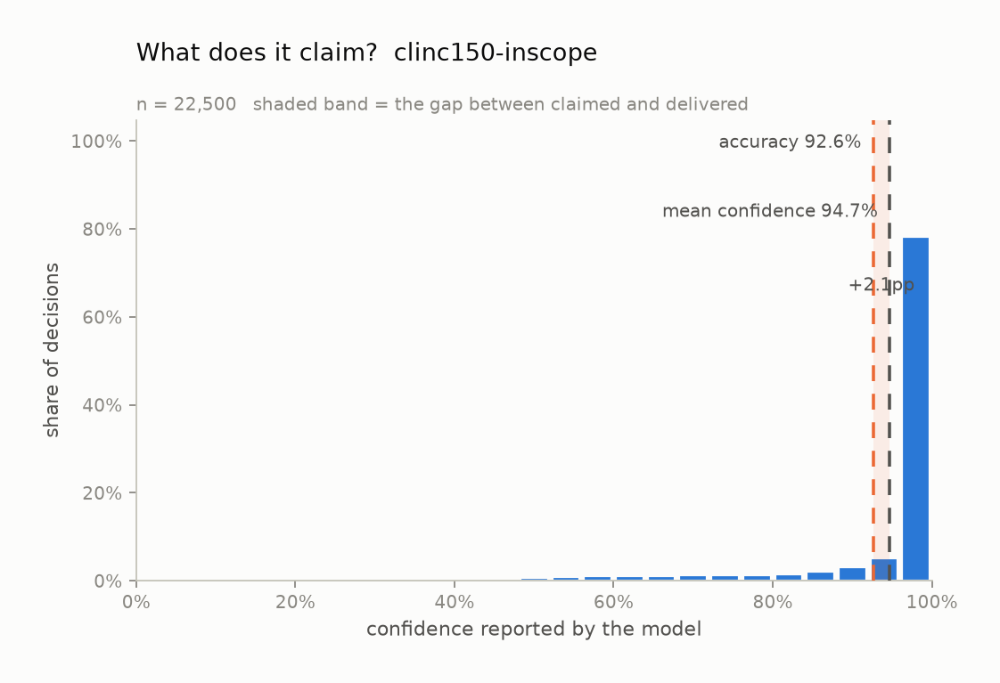
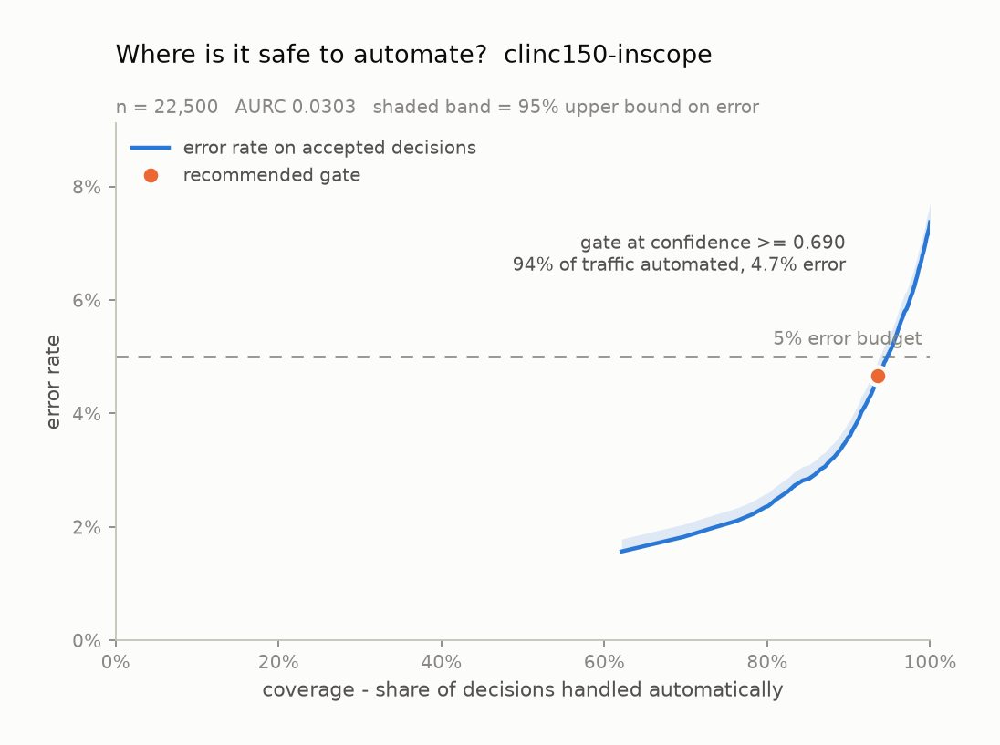
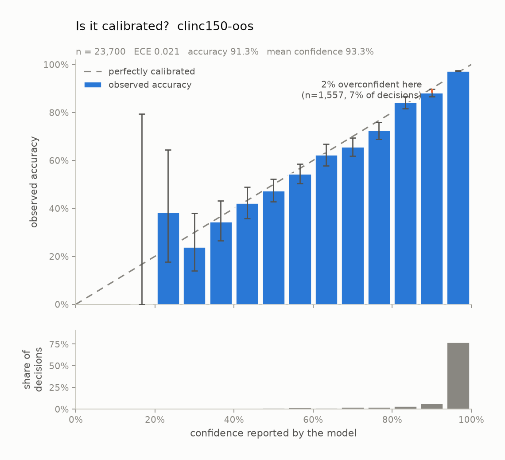

# Is Jev calibrated?

**An independent audit of TypeSafe's Jev, written for engineers who have to
decide whether to put it in production.** No statistics background assumed —
every metric is explained where it first appears.

| | |
| --- | --- |
| **Model** | `jev-1.13.0` (what `jev-latest` resolved to, 2026-09-19) |
| **Endpoint** | `api.typesafe.ai/v1/systemone` |
| **Dataset** | CLINC150 — Larson et al., EMNLP 2019, CC BY-SA 3.0 |
| **Decisions** | 51,000 across four experiments, 0 failed |
| **Cost** | $5.16, about $0.10 per 1,000 decisions |
| **Speed** | 160 ms median, end-to-end including network |

---

## The five-minute version

Jev's pitch is that every decision comes back with a probability you can trust.
That's the reason you'd put it in front of a frontier model — a confidence you
can *gate* on is worth far more than one you can only read. Nobody had published
a reliability diagram for it, so here's one.

**1. In the aggregate, it's good.** On 150-way intent classification: 92.6%
accuracy where random guessing gets 0.67%, and when it says "90%" it's right
about 90% of the time — within roughly 2 percentage points on average.

**2. It says "100%" a lot, and 100% is never true.** A probability of exactly
`1.000` on **62% of all decisions**. It's wrong 219 of those 13,977 times. Not a
big error rate, but "certain" is a claim that shouldn't have counterexamples.

**3. The biggest problem was mine, not the model's.** We handed it 150 class
names with no explanation of what they meant. Writing one sentence of
description for 16 of those 150 classes **cut the error rate on those rows by
63%** and dropped miscalibration eightfold. If you use this API the way we
originally did, you will get our bad numbers. Don't.

**4. The yes/no version doesn't work.** Ask "is this request in scope?" as a
boolean and confidence stops being informative at exactly the point you'd gate
on it. **No threshold gives you a usable error budget.** Ask the *same question*
as a multiple-choice with a "none of these" option and it works fine.

If you take one thing away: **write descriptions for your options, and prefer
Choice-with-a-rejection-option over a boolean.**

---

## What "calibrated" actually means

Skip this if it's familiar.

Any classifier can tell you its answer. A *calibrated* one also tells you how
likely that answer is to be right, and means it.

> Take every decision where the model said **70%**. If it's calibrated, about
> **70 out of 100** of those are correct. Not 90. Not 50.

This is a different property from accuracy, and the two come apart in both
directions:

- A model can be **accurate but badly calibrated** — right 95% of the time while
  always claiming 100%. Useful, but you can't act on its confidence.
- A model can be **calibrated but useless** — on a 150-way task, always answering
  "it's this one, 0.67% confidence" is perfectly calibrated and tells you
  nothing.

Calibration is what makes *automation* possible. If "95% confident" genuinely
means 5% wrong, you can auto-approve those and route the rest to a human, and
know your error rate in advance. If it doesn't mean that, you're guessing.

### The reliability diagram

The standard picture. Bucket every decision by claimed confidence, then plot
what the model *claimed* against what it *delivered*.


The dashed diagonal is perfection — claimed equals delivered. **Bars below the
line mean overconfidence**: it charged more than it delivered. The panel
underneath shows how many decisions landed in each bucket, which matters enormously
— a dramatic-looking gap over four predictions is noise, and that's exactly the
bar a screenshot will crop to.

### The three numbers used below

**ECE (Expected Calibration Error)** — average distance between the bars and the
diagonal, weighted by how many decisions are in each bucket. `0.02` means "on
average, claimed confidence is about 2 percentage points off". Lower is better;
0 is perfect. Its weakness is that it's an *average*, so a huge well-behaved
bucket can drown out a small disastrous one — which is why the bucket counts
matter.

**MCE (Maximum Calibration Error)** — the single worst bucket instead of the
average. This is what a gate trips over, because you gate on one region, not on
the average of all of them.

**AUROC** — a separate question: can confidence *rank* its errors? If you sorted
every decision by confidence, would the wrong ones cluster at the bottom? `0.5`
means no signal at all (coin flip), `1.0` means perfect separation. **This is
what a gate actually relies on**, and a model can score well here while being
badly calibrated, or vice versa.

---

## How Jev was asked

Worth understanding, because it turned out to dominate the results.

Jev doesn't generate text, so there's no prompt in the chat sense — no system
prompt, no few-shot examples, no parsing model output. Each request is
structured:

```json
{
  "model": "jev-latest",
  "state": "what expression would i use to say i love you if i were an italian",
  "questions": {
    "decision": {
      "type": "choice",
      "instructions": "Which intent does this user utterance express?",
      "criteria": {
        "accept_reservations": "accept reservations",
        "account_blocked": "account blocked",
        "...147 more...": "..."
      }
    }
  }
}
```

`criteria` **is** the classifier. All 150 class names go over the wire on every
single request, and the model returns a probability across exactly those keys.
There's no training step and nothing persisted between calls — you could send a
different 150 next time.

Two consequences engineers should note:

- **It's genuinely zero-shot.** Jev has never seen a labelled example from this
  dataset. Everything it knows about what `reminder_update` means comes from
  that string and its description.
- **The answer is structurally constrained.** Across 22,500 decisions, zero
  predictions and zero probability keys fell outside the 150 options. That's the
  "type-safe" part, and it holds. Keep it separate from correctness, though:
  every one of the 1,659 errors was a perfectly valid in-schema value that was
  simply wrong.

---

## Experiment 1 — 150-way classification (22,500 decisions)

Classify each utterance into one of CLINC150's 150 intents. The classes are
exactly balanced, so always guessing the single commonest class gets **0.67%**
(1 in 150). That baseline is what makes the accuracy number mean anything.

| metric | value | plain English |
| --- | --- | --- |
| accuracy | **92.63%** | vs. 0.67% for always guessing the same class |
| mean confidence | 94.71% | what it claimed, averaged |
| overconfidence | **+2.08%** | claimed minus delivered; positive = charges more than it delivers |
| ECE | **0.0209** (95% CI 0.0188–0.0245) | typical gap between claim and reality |
| ECE, equal-count buckets | 0.0208 | same thing, bucketed differently — agrees, so it's not a bucketing artifact |
| MCE | 0.0714 | worst single bucket |
| AUROC | **0.851** | confidence ranks its errors well |
| calibration slope | 0.283 | see below — the probabilities are too extreme |

**That's a good result.** 92.6% on a 150-way problem, with confidence that's
roughly honest and ranks its own mistakes well.

### Where the ECE comes from

This is the part a summary number hides. 81% of all decisions land in the top
bucket:

| confidence bucket | decisions | share | claimed | delivered | gap | share of ECE |
| --- | --- | --- | --- | --- | --- | --- |
| 0.13–0.20 | 4 | 0.0% | 0.181 | 0.000 | +0.181 | ~0 |
| 0.47–0.53 | 281 | 1.2% | 0.504 | 0.452 | +0.052 | 0.0007 |
| 0.87–0.93 | 1,283 | 5.7% | 0.904 | 0.891 | +0.013 | 0.0008 |
| **0.93–1.00** | **18,310** | **81.4%** | 0.994 | 0.975 | +0.019 | **0.0156** |

The worst-calibrated bucket is off by 18 points — and contributes essentially
nothing to ECE, because it holds four decisions. Three-quarters of the ECE comes
from the one huge bucket.

So **"ECE 0.021" mostly means "the big bucket is fine"**, not "every region is
fine". That matters because the big bucket is also where all your automated
decisions get made.

### The 1.000 problem

Probabilities come back rounded to two decimals, so above 0.98 there are only
three values it can report: 0.98, 0.99, 1.00. Here's what it actually says:



| reported | decisions | share | actually correct |
| --- | --- | --- | --- |
| **1.00** | **13,977** | **62.1%** | 98.43% |
| 0.99 | 1,710 | 7.6% | 96.08% |
| 0.98 | 885 | 3.9% | 94.92% |
| 0.97 | 577 | 2.6% | 94.80% |
| 0.95 | 356 | 1.6% | 91.29% |

The ordering is right — higher claims really are more accurate. But **the single
most common thing this model says is "certain", and it's wrong 219 times when it
says it.**

A 0.99 that fails 1% of the time is doing its job. A 1.00 that fails at all is
making a claim it can't support: 1.0 means *no other outcome is possible*. If
your code branches on `confidence == 1.0`, you are not getting a guarantee,
you're getting a 1.6% error rate.

### Where it's safe to automate



This is the chart most people actually need: how much traffic can you handle
automatically, at what error rate?

| error budget | gate at | traffic handled | measured error |
| --- | --- | --- | --- |
| 1% | — | — | **unreachable** — even the most selective slice errs at 1.6% |
| 5% | ≥ 0.69 | 93.6% | 4.66% |
| 10% | ≥ 0.14 | 100% | 7.37% |

**We only recommend a gate when the upper end of the error's confidence interval
clears your budget, not the best guess.** Picking the threshold that happened to
look best on your sample is how a gate that "tested at 1%" ships at 4%.

And we held them out: thresholds chosen on half the data, measured on the other
half. The 2% gate fit at 1.58% error and delivered **1.55%** on data it had never
seen. The 5% gate fit at 4.53% and held at **4.40%**. They transfer.

---

## Experiment 1b — the thing we got wrong

**This is the most important section in the report.**

Look again at the request we were sending:

```json
"criteria": {
  "reminder":        "reminder",
  "reminder_update": "reminder update"
}
```

The description is just the class name with the underscore removed. It says
nothing about what separates the two. And CLINC150 draws a real distinction here:
`reminder` means *read my reminders back to me*; `reminder_update` means *create
a new one*.

TypeSafe's own docs say it plainly: *"write descriptions that separate the
options from each other."* We didn't.

So we re-ran 2,400 rows with a single sentence of description on 16 of the 150
classes. **Same model, same 150 options, same question, same rows.** Only the
descriptions changed:

```json
"reminder":        "Read back or list reminders that already exist.",
"reminder_update": "Create a new reminder, or modify an existing one."
```

| on those 2,400 rows | bare class names | with descriptions |
| --- | --- | --- |
| accuracy | 75.25% | **90.96%** |
| errors | 594 | **217** |
| overconfidence | +14.93% | **+1.46%** |
| ECE | 0.1701 | **0.0207** |
| errors at `1.000` | 167 | **7** |

The specific confusions don't shrink, they nearly vanish:

| confusion | before | after |
| --- | --- | --- |
| `reminder_update` → `reminder` | 149 | 9 |
| `improve_credit_score` → `credit_score` | 44 | 1 |
| `last_maintenance` → `oil_change_when` | 39 | **0** |

Extrapolated to the full run, **describing 11% of the classes cuts overall
miscalibration by 59%** (ECE 0.0209 → 0.0085) and takes errors-at-certainty from
219 down to 59.

### What that means for you

- **The headline ECE was substantially measuring our prompt, not the model.**
  Jev can represent these distinctions. It hadn't been told they existed.
- **Class names are not specifications.** `reminder_update` looks
  self-documenting to you because you have the taxonomy in your head. The model
  has one string.
- **Treat this as a config bug class.** If your intent names are compounds of
  each other — `X` and `X_update`, `foo` and `change_foo` — you are at risk, and
  it's a one-line fix per class.

**Honest caveat, and it matters:** we picked those 16 classes *by looking at
which ones were failing*. That makes `0.0085` an upper bound on the benefit, not
a new headline, so we don't quote it as the result. The clean version of this
experiment — describe all 150 by a fixed rule chosen without looking at the
errors — hasn't been run yet.

---

## Experiment 2 — giving it an escape hatch (23,700 decisions)

CLINC150 ships 1,200 **out-of-scope** utterances: reasonable things a user might
say that just aren't among the 150 supported intents. *"Is there a vaccine for
ebola."* *"What's the power consumption of my fridge."*

In production this is most of your traffic. So E2 adds a 151st option, `oos`,
and asks the same question.



| | decisions | accuracy | mean confidence | gap |
| --- | --- | --- | --- | --- |
| in-scope | 22,500 | 92.32% | 94.06% | +1.74% |
| **out-of-scope** | 1,200 | 72.67% | 79.70% | **+7.04%** |

**As a rejector, it works**: it catches **72.7%** of out-of-scope queries while
wrongly rejecting only **0.89%** of legitimate ones. That's a shippable false-alarm
rate.

**But its confidence is four times worse calibrated on out-of-scope input** —
exactly the input where you most need the number to be honest. When it misses an
out-of-scope query it's 70% confident in a concrete wrong intent. The commonest
wrong destinations are `fun_fact`, `definition` and `date`.

Adding the 151st option cost essentially nothing on the in-scope rows.

---

## Experiment 3 — the same question as a boolean (2,400 decisions)

Now ask it directly, using Jev's boolean primitive: **"Is this something the
assistant can handle?"** No option list — just prose describing the scope.

Balanced 50/50, so the baseline is 50%.


| metric | value |
| --- | --- |
| accuracy | **71.92%** (baseline 50%) |
| ECE | 0.0468 |
| MCE | 0.1417 |
| AUROC | **0.663** |

And here's the failure, which is not subtle:

| confidence | decisions | accuracy |
| --- | --- | --- |
| 0.7–0.8 | 353 | 65.4% |
| 0.8–0.9 | 616 | 75.2% |
| 0.9–1.0 | 694 | 84.4% |
| **1.00** | **114** | **83.3%** |

Confidence climbs sensibly — and then **stops climbing and turns over**. In the
report's buckets, the 0.93–1.00 band claims 94.8% and delivers 80.6%, *worse than
the band below it*.

**No threshold meets an error budget of 1%, 2%, 5% or 10%.** There is no gate to
set. An AUROC of 0.663 says confidence barely ranks its own errors better than
chance.

### The comparison that matters

Same model, same underlying judgement, two framings:

| framing | result |
| --- | --- |
| Choice with a `none of these` option (E2) | 72.7% caught, 0.89% false alarms, usable confidence |
| Boolean "is this in scope?" (E3) | no workable gate at any budget |

**If you need a scope check, don't ask for a boolean.** Give the model a list to
choose from and let rejection be one of the choices.

One caveat: E3's scope description was a single prose sentence while E2 handed
over 150 explicit options. Given what section 1b showed about descriptions, some
of E3's weakness may be under-specification rather than something inherent to the
boolean primitive. We haven't isolated that yet.

---

## Things we checked so you don't have to ask

**Is the model just memorising a public dataset?** CLINC150 has been public since
2019. If it had memorised the training split we'd expect it to do better there.
It doesn't: train 92.59%, validation 93.37%, test 92.24% — a 0.35-point spread
with overlapping confidence intervals. *This rules out the training split being
special. It does not rule out the whole file being in pretraining, since all
splits are equally public.*

**Is `confidence` the same as the probability?** No, and this one is a trap.
TypeSafe returns a `confidence` field and its docs tell you to gate on it. It is
**not** the probability of the answer — it's a measure of how *peaked* the whole
distribution is (one minus its normalised entropy). On this task the two happen
to track closely because 150-option distributions are extremely peaked. On the
3-option example in TypeSafe's own docs, probabilities of `{0.84, 0.16, 0.00}`
carry a `confidence` of **0.596**. Gate on the wrong one with few options and
you'll be badly surprised. We audit `max(probabilities)` throughout.

**Does it ever return something outside the schema?** No. Zero out-of-schema
values in 22,500 decisions.

**Is the 0.01 rounding a problem?** Somewhat. Above 0.98 there are only three
values it can report, so the top of the curve is a limit of the instrument rather
than a measurement. It also makes the NLL metric meaningless here (a wrong answer
usually puts the true class at exactly 0.00), which is why we don't quote it.

---

## What we got wrong while doing this

Included because it's instructive, and because the same trap applies to anyone
reading a benchmark.

**We shipped a client that could never have worked.** The original code posted
OpenAI-style chat completions. Jev is an *evaluation* model — it doesn't generate
text and isn't served over OpenAI-compatible endpoints at all. Checking the
model card (`"max_tokens": 0`) and the vendor docs took fifteen minutes and would
have saved a rewrite.

**We published a wrong correction.** Seeing the confident errors cluster on
near-synonymous class pairs, we concluded the *dataset* was mislabelled and
claimed two-thirds of the miscalibration was annotation noise. That was wrong. We
had only looked at the rows the model got wrong, never at what CLINC150 labels
with the *other* class in each pair. One query settles it — `oil_change_when` is
used exclusively for *future* oil changes, `last_maintenance` for past ones. The
taxonomy is deliberate; the model was wrong; we retracted it.

The pattern is worth naming: **a plausible story, assembled from evidence
selected after the fact, that happened to flatter the thing being tested.** That
should trigger more scepticism, not less. It's the same failure mode this whole
repo exists to warn about, just pointed at a dataset instead of a probability.

The full retraction is in [`confident-errors.md`](confident-errors.md).

---

## What this does not show

- **One dataset licenses one claim.** This is short-utterance intent
  classification with informative class names. It is *not* "Jev is calibrated".
  Calibration is per-distribution; a model calibrated on support tickets can be
  badly calibrated on medical text.
- **Everything here fits comfortably in context.** Long or noisy state is a
  separate experiment.
- **Type-safe is not correct.** Every error counted here was a valid in-schema
  value that was wrong. "Can't emit an invalid value" and "can't be wrong" are
  different claims, and only the first is structural.
- **Gating moves the problem, it doesn't remove it.** The escalated tail still
  has to go somewhere, and that somewhere has a cost and an error rate too.
- **Latency is end-to-end including network**, not model time.
- **We measured what we measured.** No vendor figures are reproduced here.

---

## Reproducing this

```bash
python scripts/build_clinc150.py                    # fetch + build task specs
export JEV_API_KEY=...
python -m jevcal probe tasks/clinc150-inscope.json  # check the wire format first
python -m jevcal run tasks/clinc150-inscope.json --surface typesafe --concurrency 8
python -m jevcal analyze tasks/clinc150-inscope.json runs/clinc150-inscope.jsonl \
    --out results/clinc150-inscope
```

Everything needed is committed: the loader is deterministic, the task specs are
here, and every plotted value also appears as a table row so nothing is readable
only as a picture.

- [`decisions.csv`](decisions.csv) — all 48,600 decisions from E1–E3 in one
  spreadsheet, with the model's top three options, plus before/after description
  columns on the 2,400 rows that were re-run
- [`confident-errors.md`](confident-errors.md) — what it gets wrong at certainty
- [`../docs/api-notes.md`](../docs/api-notes.md) — the wire format, verified
- Per-experiment detail: [E1](clinc150-inscope/report.md) ·
  [E2](clinc150-oos/report.md) · [E3](clinc150-gate/report.md)

Keep concurrency at 8; the endpoint rate-limits above roughly that.

**A note on terms:** these numbers come from TypeSafe's direct API, which is
waitlisted behind an early-access agreement. TypeSafe's public terms contain no
clause restricting publication of evaluation results, but an early-access
agreement is a separate document. Check yours before publishing your own run.
