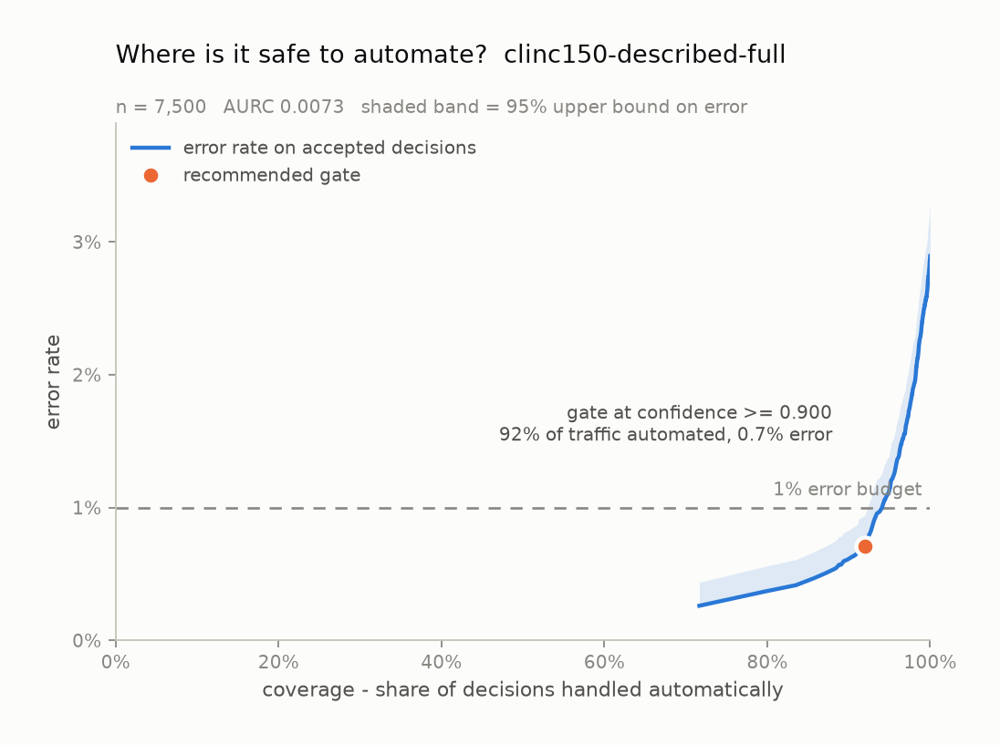
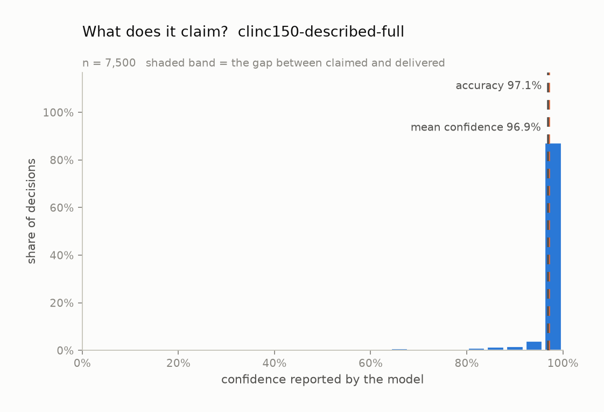

# Calibration audit: `clinc150-described-full`

*Model:* `jev-1.13.0` &nbsp;&nbsp; *Task type:* `choice` &nbsp;&nbsp; *Examples:* 7,500 &nbsp;&nbsp; *Generated:* 2026-09-20 21:49 UTC

## Verdict

On 7,500 labelled examples from `clinc150-described-full`, this model is **well calibrated** (ECE 0.005, 95% CI 0.004-0.009) with no systematic lean in either direction. Its probabilities are too extreme: a logistic refit pulls them toward the middle (fitted slope 0.55, where 1.00 is perfect). Separately from calibration, the confidence ranks its own errors at AUROC 0.924, which is what a confidence *gate* actually relies on.

## Headline numbers

| metric | value | what it means |
| --- | --- | --- |
| accuracy | 97.11% | share of decisions that matched the label |
| majority-class baseline | 0.67% | accuracy of always answering the commonest label |
| mean confidence | 96.93% | what the model claimed, on average |
| overconfidence | -0.18% | mean confidence minus accuracy; positive = charges more than it delivers |
| ECE (15 equal-width bins) | 0.0046 | average distance between claimed and delivered |
| ECE 95% CI | 0.0037 - 0.0089 | 1,000-resample bootstrap |
| ECE (15 equal-mass bins) | 0.0060 | same idea, bins holding equal counts |
| MCE (bins with n >= 30) | 0.0834 | worst single band -- what a gate trips over |
| Brier score | 0.0209 | proper score over the top label; lower is better |
| - reliability | 0.0001 | the miscalibration part; 0 is perfect |
| - resolution | 0.0056 | how far it separates cases; higher is better |
| - uncertainty | 0.0281 | irreducible difficulty of the task |
| AUROC of confidence vs. correctness | 0.9240 | can confidence rank its own errors? 0.5 = no signal |
| NLL of the true label | 0.2022 | punishes confident mistakes hardest |
| multiclass Brier | 0.0449 | over the whole distribution, not just the winner |
| logistic refit slope | 0.5462 | 1.00 = right shape; < 1 = too extreme |
| logistic refit intercept | +0.8384 | 0.00 = no constant bias |
| latency p50 / p95 | 244 ms / 397 ms | end to end, including network |
| total cost | $2.5481 | $0.3397 per 1,000 decisions |

## Is the number honest?

Every bar above is also a row here, with its 95% Wilson interval:

| confidence bin | n | mean confidence | observed accuracy | 95% CI | gap |
| --- | --- | --- | --- | --- | --- |
| 0.20-0.27 | 11 | 0.239 | 0.182 | 0.051 - 0.477 | +0.057 |
| 0.27-0.33 | 8 | 0.305 | 0.375 | 0.137 - 0.694 | -0.070 |
| 0.33-0.40 | 16 | 0.365 | 0.375 | 0.185 - 0.614 | -0.010 |
| 0.40-0.47 | 24 | 0.442 | 0.667 | 0.467 - 0.820 | -0.224 |
| 0.47-0.53 | 55 | 0.506 | 0.491 | 0.364 - 0.619 | +0.015 |
| 0.53-0.60 | 67 | 0.568 | 0.612 | 0.492 - 0.720 | -0.044 |
| 0.60-0.67 | 54 | 0.638 | 0.667 | 0.534 - 0.778 | -0.028 |
| 0.67-0.73 | 72 | 0.694 | 0.778 | 0.669 - 0.858 | -0.083 |
| 0.73-0.80 | 86 | 0.768 | 0.779 | 0.680 - 0.854 | -0.011 |
| 0.80-0.87 | 124 | 0.839 | 0.879 | 0.810 - 0.925 | -0.041 |
| 0.87-0.93 | 243 | 0.904 | 0.909 | 0.867 - 0.940 | -0.005 |
| 0.93-1.00 | 6,740 | 0.995 | 0.994 | 0.992 - 0.996 | +0.001 |

## Where is it safe to automate?

| error budget | gate at confidence | coverage | observed error | 95% upper bound | meets budget |
| --- | --- | --- | --- | --- | --- |
| 1% | >= 0.9000 | 92.0% | 0.71% | 0.94% | yes |
| 5% | >= 0.2100 | 100.0% | 2.89% | 3.30% | yes |
| 10% | >= 0.2100 | 100.0% | 2.89% | 3.30% | yes |

A gate is only recommended when the *upper* bound on its error clears the budget, not the point estimate -- picking the threshold that happened to look best on this sample is how a gate that tested at 1% ships at 4%.

## What does it claim?

## How this was measured

- Task type `choice` over 150 labels: `accept_reservations`, `account_blocked`, `alarm`, `application_status`, `apr`, `are_you_a_bot`, `balance`, `bill_balance`, `bill_due`, `book_flight`, `book_hotel`, `calculator` ...
- Confidence is the probability the model assigned to the label it picked. Nothing here asks a model to write a confidence number into its own output; a self-reported number is a different object from a calibrated distribution.
- ECE is reported with both equal-width bins (the readable version) and equal-mass bins (the version that does not let a near-empty bin swing the result).
- Intervals on bins are Wilson score intervals; the interval on ECE is a 1,000-resample percentile bootstrap.
- Run: provider `gateway`, 0 failed request(s) excluded, 266s wall clock.

## What this does not show

- Calibration measured on one dataset is calibration on that dataset. A model calibrated on product reviews can be badly calibrated on medical text.
- Bounded context matters: every example here fits comfortably in context. Long or noisy states are a separate experiment.
- Type-safe output is not correct output. Everything counted as an error below was a perfectly valid value that happened to be wrong.
- Confidence gating trades coverage for accuracy. The escalated tail still has to go somewhere, and that somewhere has its own cost.

