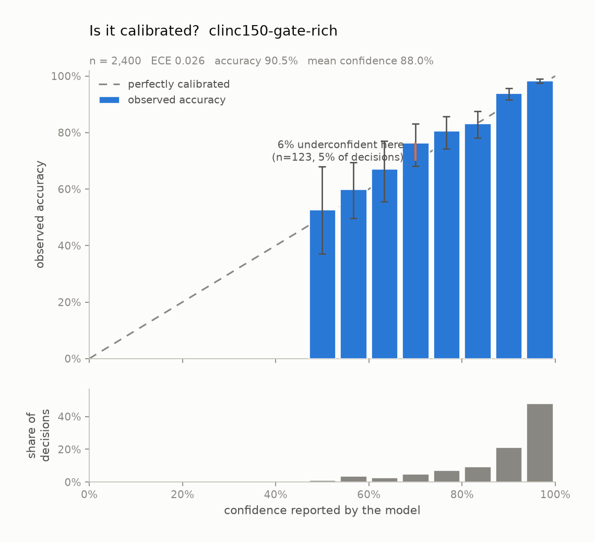
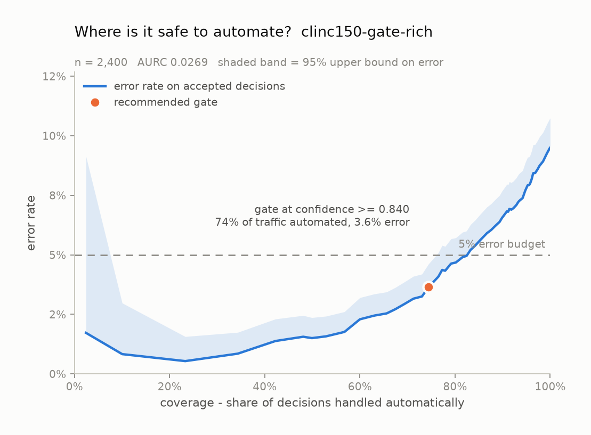
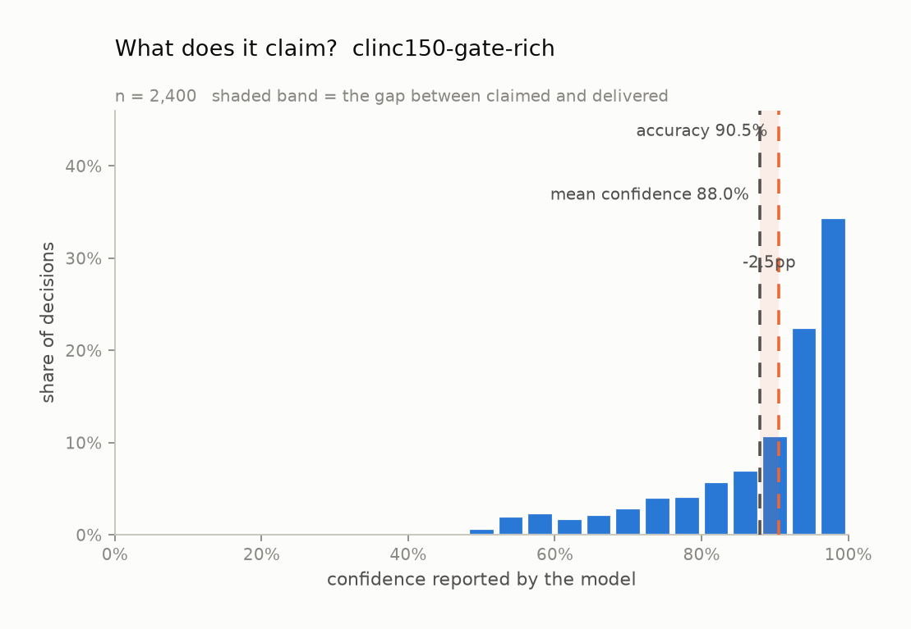

# Calibration audit: `clinc150-gate-rich`

*Model:* `jev-1.13.0` &nbsp;&nbsp; *Task type:* `noul` &nbsp;&nbsp; *Examples:* 2,400 &nbsp;&nbsp; *Generated:* 2026-09-20 21:49 UTC

## Verdict

On 2,400 labelled examples from `clinc150-gate-rich`, this model is **usably calibrated** (ECE 0.026, 95% CI 0.022-0.039) and underconfident by 2.5% on average. Its probabilities are too timid: a logistic refit pushes them outward (fitted slope 1.23, where 1.00 is perfect). Separately from calibration, the confidence ranks its own errors at AUROC 0.831, which is what a confidence *gate* actually relies on.

## Headline numbers

| metric | value | what it means |
| --- | --- | --- |
| accuracy | 90.50% | share of decisions that matched the label |
| majority-class baseline | 50.00% | accuracy of always answering the commonest label |
| mean confidence | 87.97% | what the model claimed, on average |
| overconfidence | -2.53% | mean confidence minus accuracy; positive = charges more than it delivers |
| ECE (15 equal-width bins) | 0.0259 | average distance between claimed and delivered |
| ECE 95% CI | 0.0216 - 0.0389 | 1,000-resample bootstrap |
| ECE (15 equal-mass bins) | 0.0301 | same idea, bins holding equal counts |
| MCE (bins with n >= 30) | 0.0607 | worst single band -- what a gate trips over |
| Brier score | 0.0737 | proper score over the top label; lower is better |
| - reliability | 0.0011 | the miscalibration part; 0 is perfect |
| - resolution | 0.0133 | how far it separates cases; higher is better |
| - uncertainty | 0.0860 | irreducible difficulty of the task |
| AUROC of confidence vs. correctness | 0.8310 | can confidence rank its own errors? 0.5 = no signal |
| NLL of the true label | 0.2542 | punishes confident mistakes hardest |
| multiclass Brier | 0.1474 | over the whole distribution, not just the winner |
| logistic refit slope | 1.2297 | 1.00 = right shape; < 1 = too extreme |
| logistic refit intercept | -0.0345 | 0.00 = no constant bias |
| latency p50 / p95 | 141 ms / 258 ms | end to end, including network |
| total cost | $0.0782 | $0.0326 per 1,000 decisions |

## Is the number honest?

Every bar above is also a row here, with its 95% Wilson interval:

| confidence bin | n | mean confidence | observed accuracy | 95% CI | gap |
| --- | --- | --- | --- | --- | --- |
| 0.47-0.53 | 36 | 0.517 | 0.528 | 0.370 - 0.680 | -0.010 |
| 0.53-0.60 | 90 | 0.567 | 0.600 | 0.497 - 0.695 | -0.033 |
| 0.60-0.67 | 70 | 0.635 | 0.671 | 0.555 - 0.770 | -0.037 |
| 0.67-0.73 | 123 | 0.704 | 0.764 | 0.682 - 0.831 | -0.061 |
| 0.73-0.80 | 181 | 0.769 | 0.807 | 0.743 - 0.858 | -0.037 |
| 0.80-0.87 | 234 | 0.837 | 0.833 | 0.780 - 0.876 | +0.003 |
| 0.87-0.93 | 512 | 0.906 | 0.940 | 0.915 - 0.957 | -0.033 |
| 0.93-1.00 | 1,154 | 0.963 | 0.984 | 0.976 - 0.990 | -0.021 |

## Where is it safe to automate?

| error budget | gate at confidence | coverage | observed error | 95% upper bound | meets budget |
| --- | --- | --- | --- | --- | --- |
| 1% | >= 0.9600 | 34.3% | 0.85% | 1.74% | provisional |
| 5% | >= 0.8400 | 74.4% | 3.64% | 4.61% | yes |
| 10% | >= 0.5500 | 97.8% | 8.74% | 9.95% | yes |

A gate is only recommended when the *upper* bound on its error clears the budget, not the point estimate -- picking the threshold that happened to look best on this sample is how a gate that tested at 1% ships at 4%.

## What does it claim?

## How this was measured

- Task type `noul` over 2 labels: `true`, `false`
- Confidence is the probability the model assigned to the label it picked. Nothing here asks a model to write a confidence number into its own output; a self-reported number is a different object from a calibrated distribution.
- ECE is reported with both equal-width bins (the readable version) and equal-mass bins (the version that does not let a near-empty bin swing the result).
- Intervals on bins are Wilson score intervals; the interval on ECE is a 1,000-resample percentile bootstrap.
- Run: provider `gateway`, 0 failed request(s) excluded, 46s wall clock.

## What this does not show

- Calibration measured on one dataset is calibration on that dataset. A model calibrated on product reviews can be badly calibrated on medical text.
- Bounded context matters: every example here fits comfortably in context. Long or noisy states are a separate experiment.
- Type-safe output is not correct output. Everything counted as an error below was a perfectly valid value that happened to be wrong.
- Confidence gating trades coverage for accuracy. The escalated tail still has to go somewhere, and that somewhere has its own cost.

