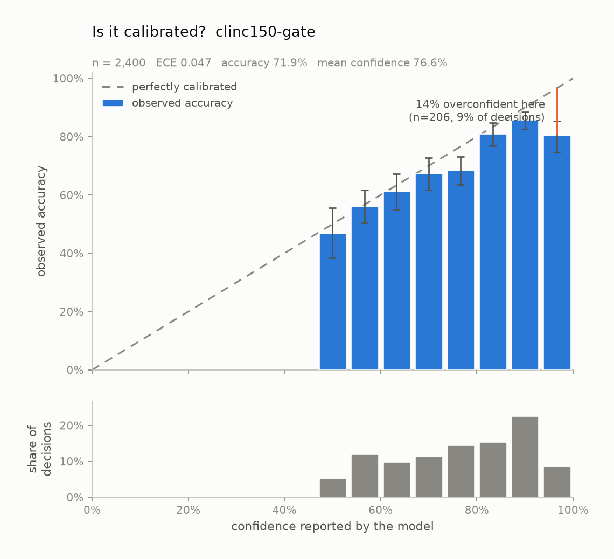
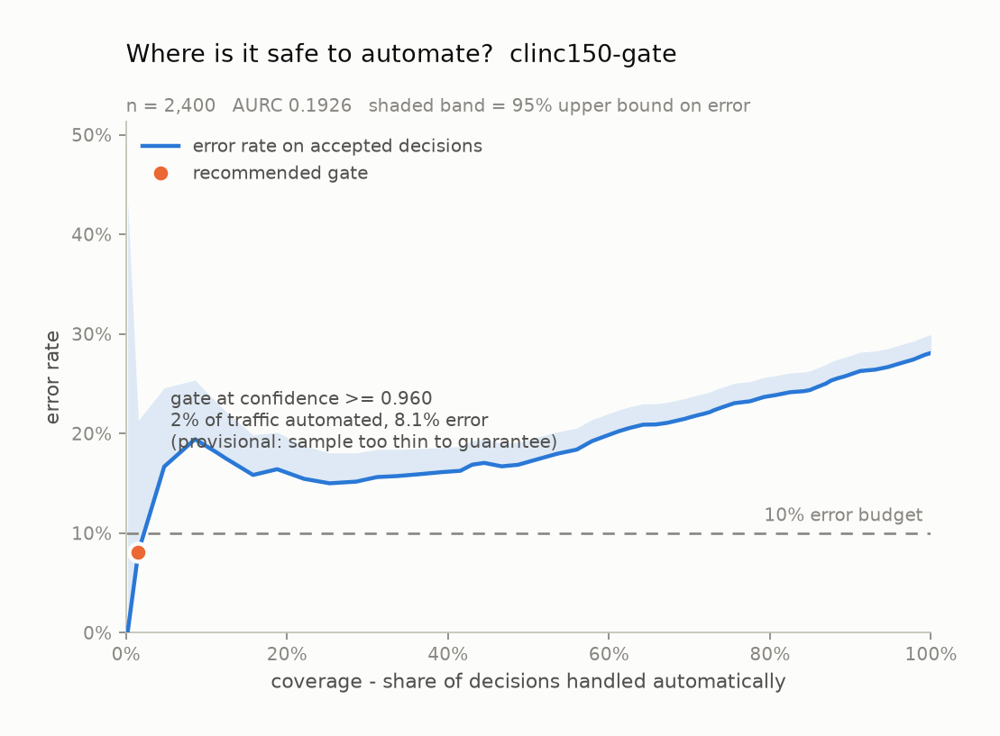
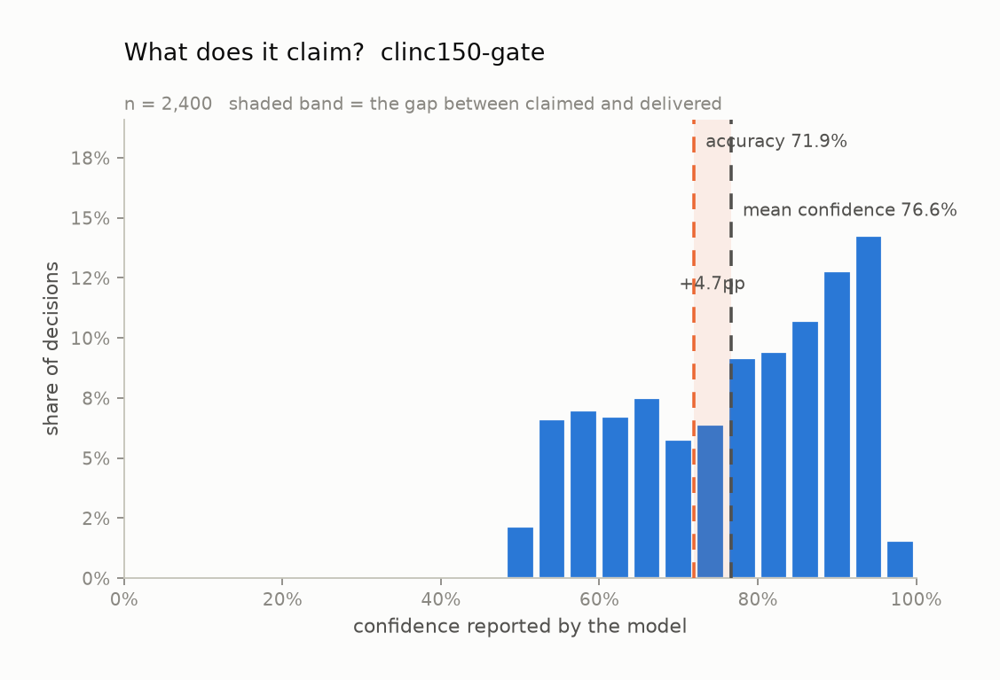

# Calibration audit: `clinc150-gate`

*Model:* `jev-1.13.0` &nbsp;&nbsp; *Task type:* `noul` &nbsp;&nbsp; *Examples:* 2,400 &nbsp;&nbsp; *Generated:* 2026-09-20 00:24 UTC

## Verdict

On 2,400 labelled examples from `clinc150-gate`, this model is **usably calibrated** (ECE 0.047, 95% CI 0.037-0.066) and overconfident by 4.7% on average. Its probabilities are too extreme: a logistic refit pulls them toward the middle (fitted slope 0.69, where 1.00 is perfect). Separately from calibration, the confidence ranks its own errors at AUROC 0.663, which is what a confidence *gate* actually relies on.

## Headline numbers

| metric | value | what it means |
| --- | --- | --- |
| accuracy | 71.92% | share of decisions that matched the label |
| majority-class baseline | 50.00% | accuracy of always answering the commonest label |
| mean confidence | 76.60% | what the model claimed, on average |
| overconfidence | +4.68% | mean confidence minus accuracy; positive = charges more than it delivers |
| ECE (15 equal-width bins) | 0.0468 | average distance between claimed and delivered |
| ECE 95% CI | 0.0369 - 0.0659 | 1,000-resample bootstrap |
| ECE (15 equal-mass bins) | 0.0518 | same idea, bins holding equal counts |
| MCE (bins with n >= 30) | 0.1417 | worst single band -- what a gate trips over |
| Brier score | 0.1910 | proper score over the top label; lower is better |
| - reliability | 0.0038 | the miscalibration part; 0 is perfect |
| - resolution | 0.0148 | how far it separates cases; higher is better |
| - uncertainty | 0.2020 | irreducible difficulty of the task |
| AUROC of confidence vs. correctness | 0.6628 | can confidence rank its own errors? 0.5 = no signal |
| NLL of the true label | 0.5736 | punishes confident mistakes hardest |
| multiclass Brier | 0.3821 | over the whole distribution, not just the winner |
| logistic refit slope | 0.6950 | 1.00 = right shape; < 1 = too extreme |
| logistic refit intercept | +0.0634 | 0.00 = no constant bias |
| latency p50 / p95 | 130 ms / 256 ms | end to end, including network |
| total cost | $0.0348 | $0.0145 per 1,000 decisions |

## Is the number honest?

Every bar above is also a row here, with its 95% Wilson interval:

| confidence bin | n | mean confidence | observed accuracy | 95% CI | gap |
| --- | --- | --- | --- | --- | --- |
| 0.47-0.53 | 128 | 0.517 | 0.469 | 0.385 - 0.555 | +0.048 |
| 0.53-0.60 | 292 | 0.569 | 0.562 | 0.504 - 0.617 | +0.008 |
| 0.60-0.67 | 238 | 0.634 | 0.613 | 0.550 - 0.673 | +0.021 |
| 0.67-0.73 | 273 | 0.699 | 0.674 | 0.616 - 0.727 | +0.025 |
| 0.73-0.80 | 349 | 0.772 | 0.685 | 0.634 - 0.731 | +0.087 |
| 0.80-0.87 | 371 | 0.836 | 0.811 | 0.768 - 0.848 | +0.024 |
| 0.87-0.93 | 543 | 0.902 | 0.858 | 0.826 - 0.885 | +0.043 |
| 0.93-1.00 | 206 | 0.948 | 0.806 | 0.746 - 0.854 | +0.142 |

## Where is it safe to automate?

| error budget | gate at confidence | coverage | observed error | 95% upper bound | meets budget |
| --- | --- | --- | --- | --- | --- |
| 1% | not reachable | - | - | - | no threshold reaches 1.0% error; the most selective usable slice still errs at 8.1% |
| 5% | not reachable | - | - | - | no threshold reaches 5.0% error; the most selective usable slice still errs at 8.1% |
| 10% | >= 0.9600 | 1.5% | 8.11% | 21.30% | provisional |

A gate is only recommended when the *upper* bound on its error clears the budget, not the point estimate -- picking the threshold that happened to look best on this sample is how a gate that tested at 1% ships at 4%.

## What does it claim?

## How this was measured

- Task type `noul` over 2 labels: `true`, `false`
- Confidence is the probability the model assigned to the label it picked. Nothing here asks a model to write a confidence number into its own output; a self-reported number is a different object from a calibrated distribution.
- ECE is reported with both equal-width bins (the readable version) and equal-mass bins (the version that does not let a near-empty bin swing the result).
- Intervals on bins are Wilson score intervals; the interval on ECE is a 1,000-resample percentile bootstrap.
- Run: provider `gateway`, 0 failed request(s) excluded, 44s wall clock.

## What this does not show

- Calibration measured on one dataset is calibration on that dataset. A model calibrated on product reviews can be badly calibrated on medical text.
- Bounded context matters: every example here fits comfortably in context. Long or noisy states are a separate experiment.
- Type-safe output is not correct output. Everything counted as an error below was a perfectly valid value that happened to be wrong.
- Confidence gating trades coverage for accuracy. The escalated tail still has to go somewhere, and that somewhere has its own cost.

