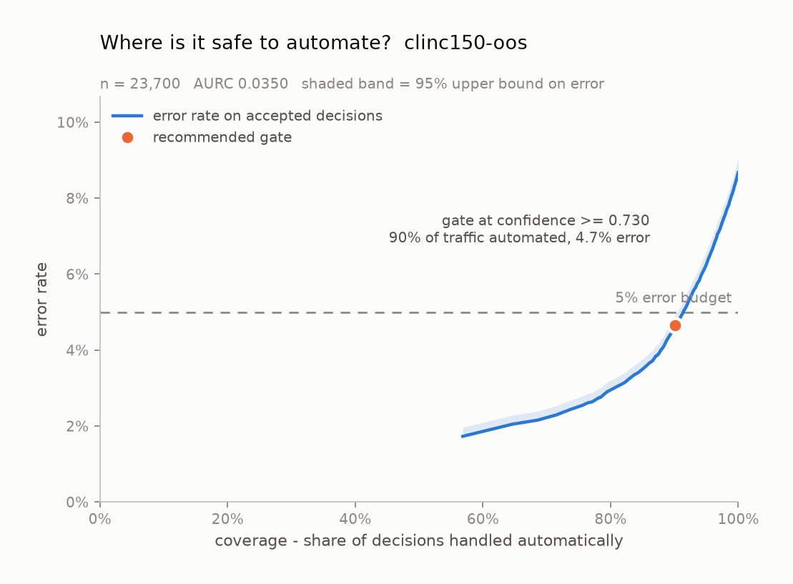
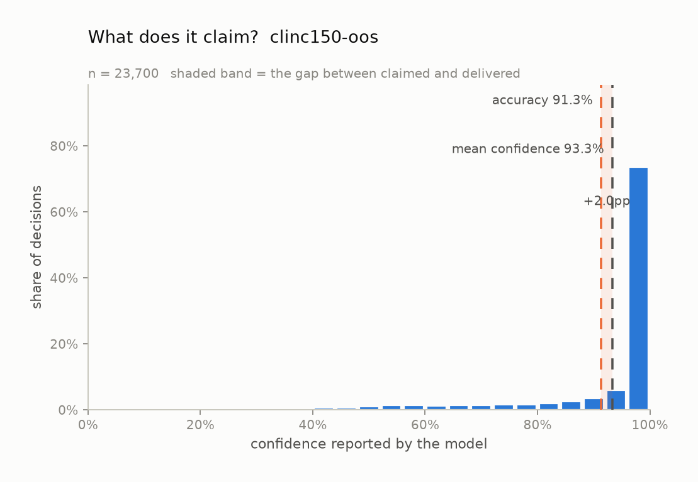

# Calibration audit: `clinc150-oos`

*Model:* `jev-1.13.0` &nbsp;&nbsp; *Task type:* `choice` &nbsp;&nbsp; *Examples:* 23,700 &nbsp;&nbsp; *Generated:* 2026-09-20 00:24 UTC

## Verdict

On 23,700 labelled examples from `clinc150-oos`, this model is **usably calibrated** (ECE 0.021, 95% CI 0.018-0.024) and overconfident by 2.0% on average. Its probabilities are too extreme: a logistic refit pulls them toward the middle (fitted slope 0.29, where 1.00 is perfect). Separately from calibration, the confidence ranks its own errors at AUROC 0.851, which is what a confidence *gate* actually relies on.

## Headline numbers

| metric | value | what it means |
| --- | --- | --- |
| accuracy | 91.32% | share of decisions that matched the label |
| majority-class baseline | 5.06% | accuracy of always answering the commonest label |
| mean confidence | 93.34% | what the model claimed, on average |
| overconfidence | +2.01% | mean confidence minus accuracy; positive = charges more than it delivers |
| ECE (15 equal-width bins) | 0.0207 | average distance between claimed and delivered |
| ECE 95% CI | 0.0184 - 0.0244 | 1,000-resample bootstrap |
| ECE (15 equal-mass bins) | 0.0201 | same idea, bins holding equal counts |
| MCE (bins with n >= 30) | 0.0667 | worst single band -- what a gate trips over |
| Brier score | 0.0608 | proper score over the top label; lower is better |
| - reliability | 0.0005 | the miscalibration part; 0 is perfect |
| - resolution | 0.0183 | how far it separates cases; higher is better |
| - uncertainty | 0.0792 | irreducible difficulty of the task |
| AUROC of confidence vs. correctness | 0.8515 | can confidence rank its own errors? 0.5 = no signal |
| NLL of the true label | 0.7395 | punishes confident mistakes hardest |
| multiclass Brier | 0.1360 | over the whole distribution, not just the winner |
| logistic refit slope | 0.2876 | 1.00 = right shape; < 1 = too extreme |
| logistic refit intercept | +0.8111 | 0.00 = no constant bias |
| latency p50 / p95 | 158 ms / 283 ms | end to end, including network |
| total cost | $2.5096 | $0.1059 per 1,000 decisions |

## Is the number honest?

Every bar above is also a row here, with its 95% Wilson interval:

| confidence bin | n | mean confidence | observed accuracy | 95% CI | gap |
| --- | --- | --- | --- | --- | --- |
| 0.13-0.20 | 1 | 0.192 | 0.000 | 0.000 - 0.793 | +0.192 |
| 0.20-0.27 | 13 | 0.240 | 0.385 | 0.177 - 0.645 | -0.144 |
| 0.27-0.33 | 46 | 0.306 | 0.239 | 0.139 - 0.379 | +0.067 |
| 0.33-0.40 | 122 | 0.371 | 0.344 | 0.266 - 0.432 | +0.027 |
| 0.40-0.47 | 211 | 0.433 | 0.422 | 0.357 - 0.489 | +0.012 |
| 0.47-0.53 | 421 | 0.502 | 0.475 | 0.428 - 0.523 | +0.027 |
| 0.53-0.60 | 567 | 0.570 | 0.545 | 0.504 - 0.586 | +0.025 |
| 0.60-0.67 | 426 | 0.636 | 0.624 | 0.578 - 0.669 | +0.012 |
| 0.67-0.73 | 606 | 0.701 | 0.657 | 0.618 - 0.694 | +0.044 |
| 0.73-0.80 | 604 | 0.769 | 0.725 | 0.688 - 0.759 | +0.044 |
| 0.80-0.87 | 845 | 0.837 | 0.843 | 0.817 - 0.866 | -0.006 |
| 0.87-0.93 | 1,557 | 0.904 | 0.883 | 0.866 - 0.898 | +0.021 |
| 0.93-1.00 | 18,281 | 0.993 | 0.974 | 0.971 - 0.976 | +0.020 |

## Where is it safe to automate?

| error budget | gate at confidence | coverage | observed error | 95% upper bound | meets budget |
| --- | --- | --- | --- | --- | --- |
| 1% | not reachable | - | - | - | no threshold reaches 1.0% error; the most selective usable slice still errs at 1.7% |
| 5% | >= 0.7300 | 90.1% | 4.66% | 4.95% | yes |
| 10% | >= 0.1919 | 100.0% | 8.68% | 9.04% | yes |

A gate is only recommended when the *upper* bound on its error clears the budget, not the point estimate -- picking the threshold that happened to look best on this sample is how a gate that tested at 1% ships at 4%.

## What does it claim?

## How this was measured

- Task type `choice` over 151 labels: `accept_reservations`, `account_blocked`, `alarm`, `application_status`, `apr`, `are_you_a_bot`, `balance`, `bill_balance`, `bill_due`, `book_flight`, `book_hotel`, `calculator` ...
- Confidence is the probability the model assigned to the label it picked. Nothing here asks a model to write a confidence number into its own output; a self-reported number is a different object from a calibrated distribution.
- ECE is reported with both equal-width bins (the readable version) and equal-mass bins (the version that does not let a near-empty bin swing the result).
- Intervals on bins are Wilson score intervals; the interval on ECE is a 1,000-resample percentile bootstrap.
- Run: provider `gateway`, 0 failed request(s) excluded, 1s wall clock.

## What this does not show

- Calibration measured on one dataset is calibration on that dataset. A model calibrated on product reviews can be badly calibrated on medical text.
- Bounded context matters: every example here fits comfortably in context. Long or noisy states are a separate experiment.
- Type-safe output is not correct output. Everything counted as an error below was a perfectly valid value that happened to be wrong.
- Confidence gating trades coverage for accuracy. The escalated tail still has to go somewhere, and that somewhere has its own cost.

